# Ansible for the Absolute Beginners Course

## Ansible

### Introduction

Ansible을 사용하는 이유는 다음과 같은 작업들을 쉽고 효율적으로 하기 위함이다. Shell Script를 이용하여 다음 작업들을 수행할 수도 있지만, Ansible이 더 배우기 쉽고 간단하고 자동화를 위한 여러 가지 기능을 제공하기 때문이다.

- Provisioning
- Configuration Management
- Continuous Delivery
- Application Deployment
- Security Compliance

### Install Ansible

- CentOS / RHEL

    `yum install epel-release` 로 EPEL Repository 추가

    `yum install ansible` 설치

- Debian / Ubuntu

    `apt install ansible`

설치 후 `ansible --version`으로 설치된 버전 확인

`inventory.txt` 파일에 Client 또는 그룹을 지정하여 사용할 수 있다.

```
# inventory.txt
target1 ansible_host=192.168.0.17 ansible_ssh_pass=password
```

`ansible target1 -m ping -i inventory.txt` 명령을 실행하게 되면 target1 으로 ping 모듈을 사용하고 해당 결과를 반환하게 된다.

만약 ansible은 ssh를 이용하여 명령을 실행하므로 host의 key file이 등록되지 않은 경우에는 에러가 발생할 수 있다. 이 부분은 `/etc/ansible/ansible.cfg` 파일의 `host_key_checking = False` 부분의 주석을 해제해주면 된다. 그러나 이 방법은 안전하지 않을 수 있기 때문에 권장하지 않는다.

## Ansible Concepts

### Ansible Inventory

Ansible은  Linux는 SSH, Windows는 Powershell Remoting을 이용한다.

Ansible은 Client에 별도의 프로그램 설치를 필요하지 않기 때문에 Agentless하다.

- Inventory

    Client의 정보를 담은 파일. Inventory파일이 존재하지 않을 경우에는 `/etc/ansible/hosts` 에 있는 정보를 이용한다.

    ```
    # /etc/ansible/hosts

    server1.company.com
    server2.company.com

    [mail]
    server3.company.com
    server4.company.com

    [db]
    server5.company.com
    server6.company.com

    [web]
    server7.company.com
    server8.company.com
    ```

    ```
    # inventory.txt

    web  ansible_host=server1.company.com ansible_connection=ssh ansible_user=root ansible_ssh_pass=P@#
    db   ansible_host=server2.company.com ansible_connection=winrm
    mail ansible_host=server3.company.com ansible_connection=ssh
    web2 ansible_host=server4.company.com ansible_connection=winrm

    localhost ansible_connection=localhost
    ```

- Inventory Parameters
    - `ansible_connection` : ssh/winrm/localhost
    - `ansible_port` : 22/5986
    - `ansible_user` : root/administrator
    - `ansible_ssh_pass` : Password
- Group of groups

    ```
    # Sample Inventory File

    # Database Servers
    sql_db1 ansible_host=sql01.xyz.com ansible_connection=ssh ansible_user=root ansible_ssh_pass=Lin$Pass
    sql_db2 ansible_host=sql02.xyz.com ansible_connection=ssh ansible_user=root ansible_ssh_pass=Lin$Pass

    # Web Servers
    web_node1 ansible_host=web01.xyz.com ansible_connection=winrm ansible_user=administrator ansible_password=Win$Pass
    web_node2 ansible_host=web02.xyz.com ansible_connection=winrm ansible_user=administrator ansible_password=Win$Pass
    web_node3 ansible_host=web03.xyz.com ansible_connection=winrm ansible_user=administrator ansible_password=Win$Pass

    [db_nodes]
    sql_db1
    sql_db2

    [web_nodes]
    web_node1
    web_node2
    web_node3

    [boston_nodes]
    sql_db1
    web_node1

    [dallas_nodes]
    sql_db2
    web_node2
    web_node3

    [us_nodes:children]
    boston_nodes
    dallas_nodes
    ```

### Ansible Playbooks

Ansible Playbook은 각 서버에서 특정 명령어를 실행하거나, 재부팅하는 등의 간단한 작업부터 클러스터 환경 구축이나 각 서버별 설정을 다르게 하는 등 여러가지 복잡한 작업도 가능하게 해준다.

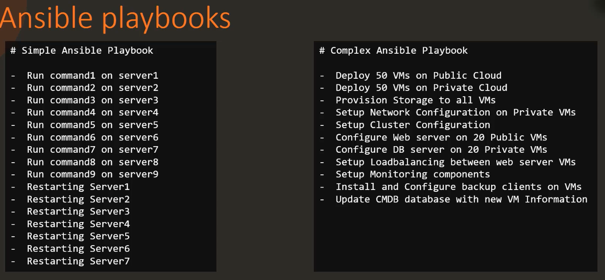

- Playbook - A single YAML file
    - Play - Defines a set of activities(tasks) to be run on hosts
        - Task - An action to be performed on the host
            - Execute a command
            - Runa script
            - Install a package
            - Shutdown/Restart

    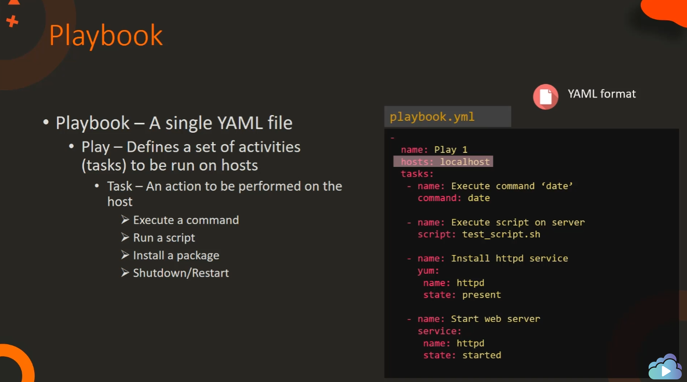

- Playbook format

    각 Playbook은 List로 구성되어 있다. Playbook 안에서 Dictionary는 순서가 바뀌어도 같은 결과를 나타내지만, Task는 List로 구성되어 있기 때문에 순서가 바뀔 경우에는 실행 순서도 바뀌게 되므로 주의한다.

    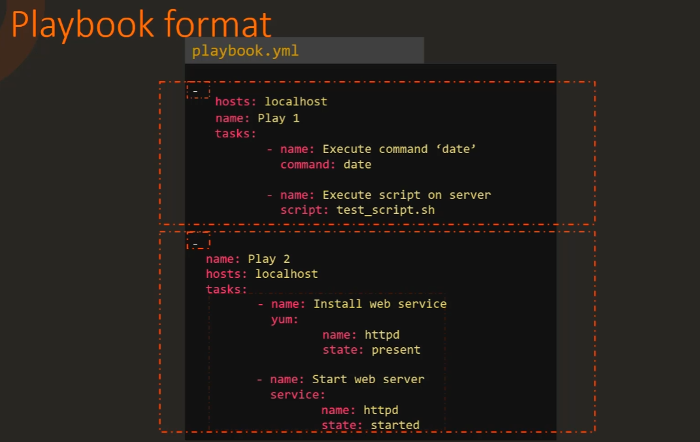

- Hosts

    Playbook의 hosts 속성은 inventory 파일에 정의되어 있는 host를 기준으로 실행된다. 따라서 inventory에서 적절하게 그룹을 나누어주거나 정리하는 작업이 필요하다.

    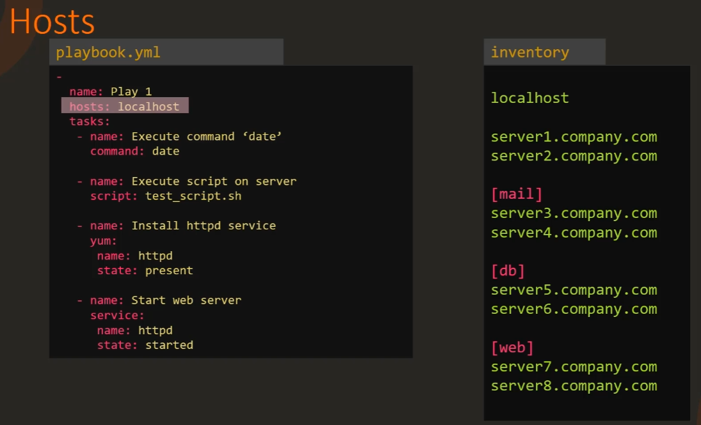

- module

    module은 Ansible을에서 제공하는 여러 가지 기능들을 말한다. command, script, yum, service와 같이 다양한 module이 존재하며, 관련 내용은 공식 문서에서 확인할 수 있다. 또는 `ansible-doc -l` 명령어를 이용하여 확인할 수 있다.

    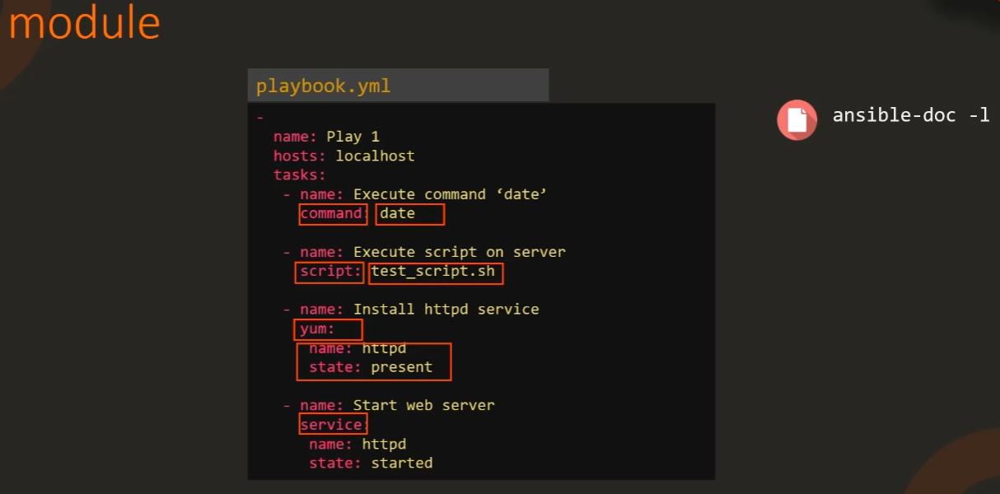

- Run
    - Ansible Playbook을 이용한 명령어 실행
    - Syntax : `ansible-playbook <playbook file name>`
    - `ansible-playbook --help`

### Modules

Ansible은 각 기능에 맞는 여러가지 module을 지원한다.

- Modules
    - System : system level에서 작동하는 기능
        - User, Group, Hostname, Iptables, Lvg, Lvol, Make, Mount, Ping, Timezone, Systemd, Service
    - Commands : command나 script 관련 기능
        - Command, Expect, Raw, Script, Shell
    - Files : file 관련 기능
        - Acl, Archive, Copy, File, Find, Lineinfile, Replace, Stat, Template, Unarchive
    - Database : database 설정 관련 기능
        - Mongodb, Mssql, Mysql, Postgresql, Proxysql, vertica
    - Cloud : 인스턴스 생성, 설정 변경, 네트워크 및 보안 등 클라우드 관련 기능
        - Amazon, Atomic, Azure, Centrylink, Cloudscale, Cloudstack, Digital Ocean, Docker, Google, Linode, Openstack, Rackspace, Smartos, Softlayer, VMware
    - Windows : Window 관련 기능
        - Win_copy, Win_command, Win_domain, Win_file, Win_iis_website, Win_msg, Win_msi, Win_package, Win_ping, Win_path, Win_robocopy, Win_regedit, Win_shell, Win_service, Win_user
    - More..
- 주요 기능 설명
    - command : 원격 노드에 해당 명령을 실행

        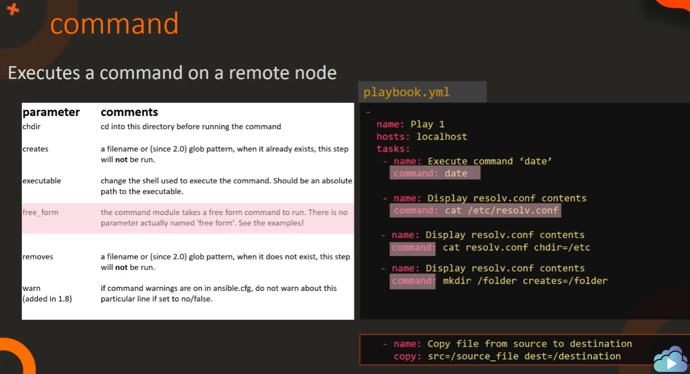

    - script : local의 script를 원격 노드에서 실행

        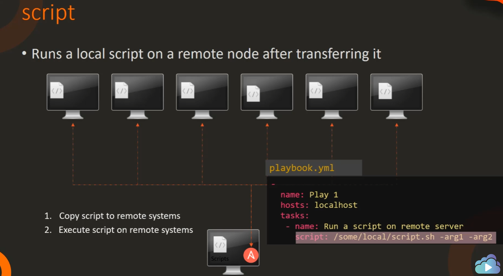

    - Service : Serivce들을 관리 - Start, Stop, Restart

        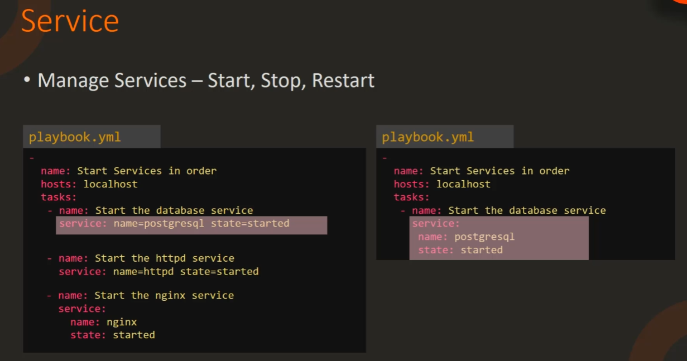

        state가 start가 아닌 started인 이유는 현재 상태를 나타내는 것이기 때문에 start하는 것이 아니고 started 되어 있어야 하는 것이다. 따라서 해당 Service가 실행 중이 아니면 start하는 것이고, started 되어 있으면 아무 행동도 하지 않는다.

        이러한 성질을 Idempotency(멱등성)라고 하며, 쉽게 이야기해서 해당 명령을 여러 번 반복해도 같은 결과가 나타나는 성질을 말한다.

        예를 들어, hosts 파일에 IP를 추가한다고 했을 때, `echo 192.168.0.10 >> /etc/hosts` 명령어를 여러 번 반복하면 hosts 파일에는 여러 개의 같은 IP가 입력될 것이다. 그러나 Idempotency한 성질을 가지고 있으면 여러 번 같은 명령을 반복해도 hosts 파일에는 중복 없이 하나의 IP만 입력된다.  

        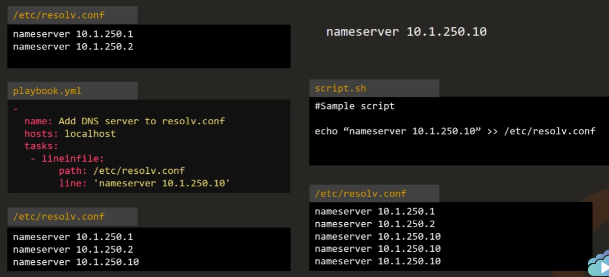

    - lineinfile : 해당 파일에서 특정 line을 찾아 바꾸거나 없으면 추가하는 기능

        lineinfile을 Idempotency 를 가진다.

    ### Variables

    Ansible은 하나의 Playbook으로 여러 개의 host를 관리한다. 따라서 host마다 다른 설정이 필요하거나 한 경우에는 variable을 이용할 수 있다.

    variable은 Playbook에 `vars`라는 속성을 이용하여 설정하거나, 별도의 `variables` 파일을 이용하여 dictionary 형태로 저장할 수 있다.

    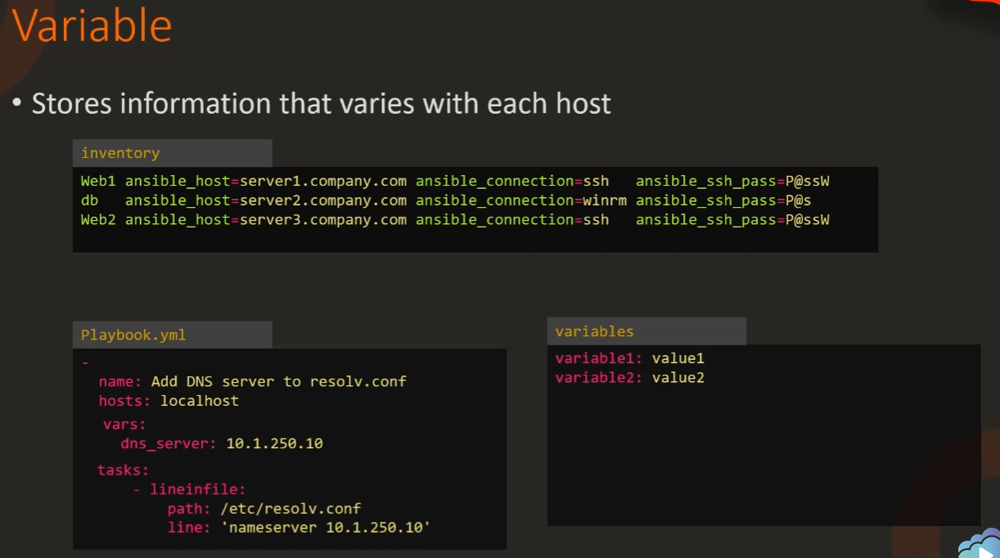

    variable을 사용할 때는 double curly braces(`{{ }}`) 안에 변수명을 넣어 사용한다. 이와 같은 사용법을 Jinja2 Templating 이라고 하며, double curly braces는 단독으로 사용하지 않는다.

    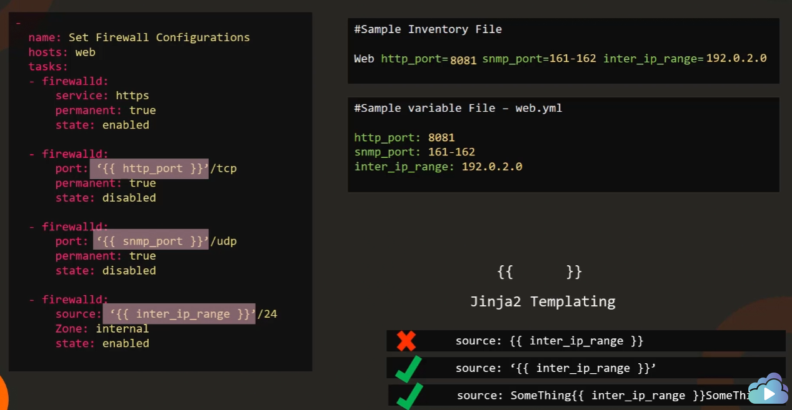
    
## Conditionals, Loops & Roles

### Ansible Conditionals

OS마다 패키지 매니저가 다르기 때문에 특정 조건에 따라 다른 패키지 매니저를 사용할 때 Condition을 이용한다.

- when : 해당 task를 실행시킬 조건을 지정하며, and나 or같은 연산자를 이용하여 여러 가지 조건을 추가할 수 있다.

    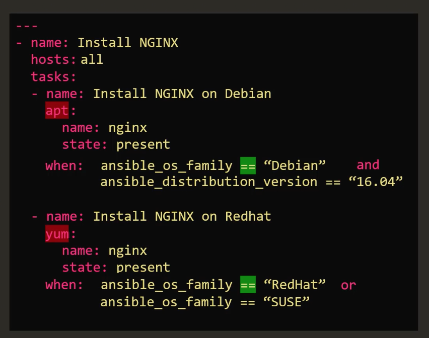

- Loops : 반복되는 작업을 variable list로 만들어서 반복할 수 있다. `loop` 속성에 `vars` 에서 정의한 속성의 넣으면 해당 속성은 `tasks` 내부에서 `item` 으로 접근할 수 있다.

    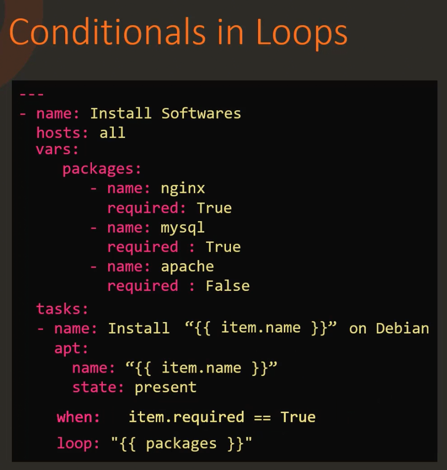

- Register : 해당 명령의 결과를 변수로 저장하기 위한 모듈이다. `register` 안에는 `stdout` 을 포함한 여러 가지 method가 존재하며, 해당 모듈을 이용하여 더 복잡한 조건을 지정할 수 있다.

    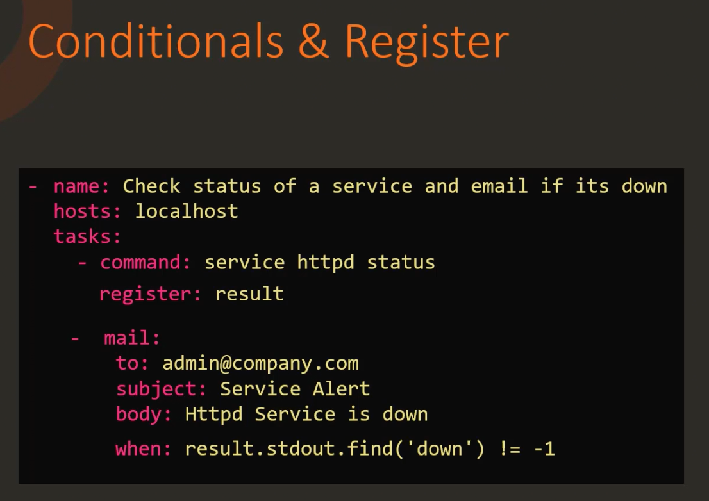

### Ansible Loops

Loops는 반복되는 작업을 효율적으로 처리할 수 있도록 도와준다. `loop` 속성에 List 형식으로 값들을 정의하면 해당 값은 `tasks` 안에서 `item` 이라는 이름으로 사용할 수 있다.

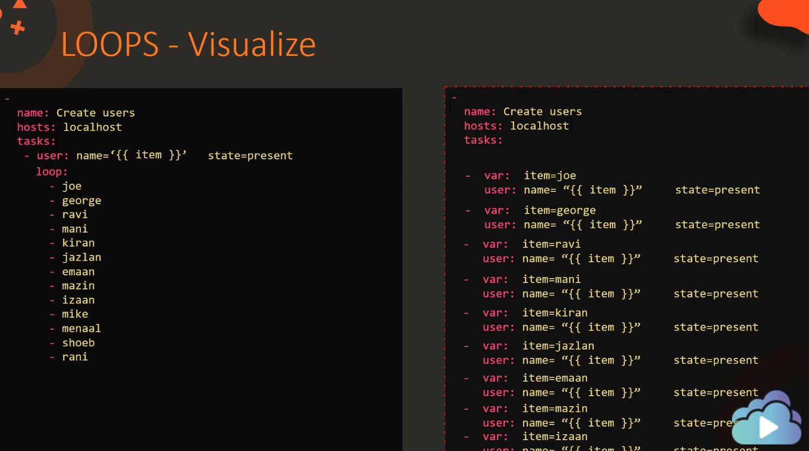

하나의 속성에 여러 가지 변수를 사용하고 싶을 땐 key, value 형태의 dictionary를 사용한다. 각 key는 item 의 속성이 되어 `item.key` 로 접근할 수 있다.

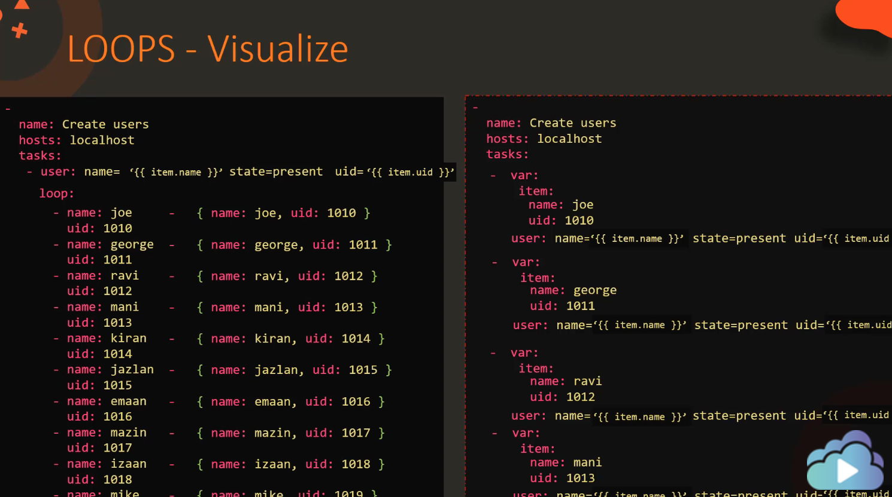

With_* 구문을 이용하면 여러가지 반복가능한 요소들에 대하여 더 쉽게 사용할 수 있다.

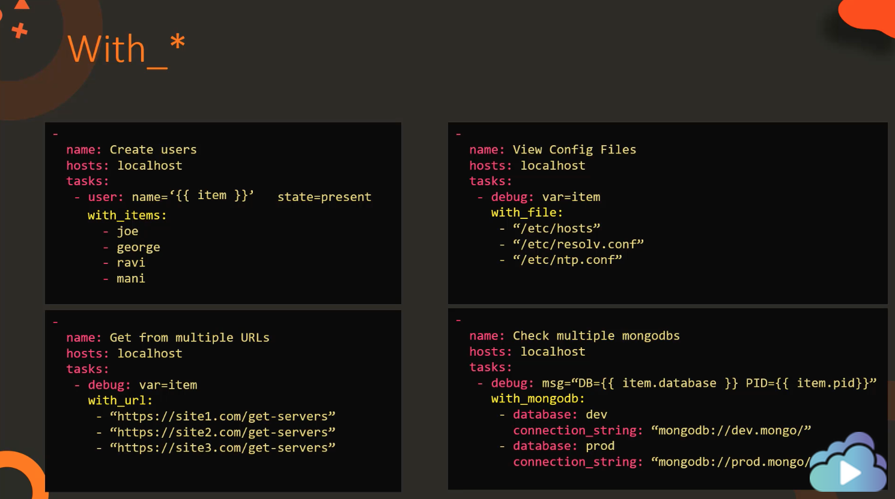

With_* 구문은 다양한 요소들을 제공한다.

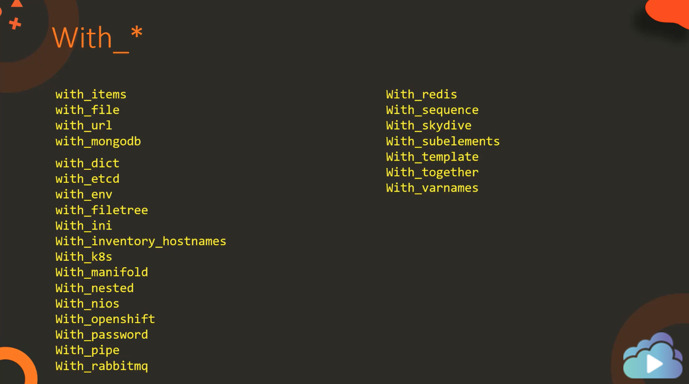
