# Linux

- foreground / background
    - `sudo -s` : 관리자 권한 얻기
    - `jobs -l` : 중지된 프로세스 확인
    - `bg [process id]` : background로 실행하기
    - `fg [process id]` : foreground로 실행하기
    - command 뒤에 `&`를 붙이면 background 로 실행할 수 있다.
- `dig +trace [url]` : DNS trace util

## Working with the Shell

- `pushd / popd` : 현재 디렉토리를 stack에 저장해둘 수 있다.
- `type` : 해당 명령어의 type을 확인할 수 있다.
- help command
    - `whatis` : display one-line manual page descriptions
    - `man` : an interface to the system reference manuals
    - `apropos` : search the manual page names and descriptions
- `chsh` : 로그인 Shell 변경 가능
- `echo $PS1` : 로그인 정보가 담겨있는 환경변수
    - `PS1="something"` 으로 변경할 수 있다

    

## Linux Core Concepts

### Linux Kernel

- Kernel이란?

    도서관에서 학생들이 도서관에 있는 책들을 사서를 통해 빌려가고 하는 것 처럼 커널은 컴퓨터 하드웨어 자원과 소프트웨어 사이에서 효율적인 동작을 위해 존재하는 중개자 같은 역할이다.

    커널의 역할은 크게 다음과 같이 나눌 수 있다.

    1. Memory Management
        - Kernel Space
            - Kernel Code
            - Kernel Extensions
            - Device Drives
        - User Space
            - Application / Programs (C, Java, Python etc.)
    2. Process Management
    3. Device Drivers
    4. System Calls ans Security

### Linux Hardware

- `uname` : 커널의 정보를 알려준다.
    - `uname -r or -a` : 커널의 버전을 알려준다.
- `dmesg` : 커널 영역의 메세지를 출력한다.
- `udevadm` : udev 관련 정보를 출력한다.
    - `udevadm info --query=path --name=/dev/sda5`
    - `udevadm monitor`
- `lspci` : PCI 목록을 출력한다.
- `lsblk` : Block Devices를 출력한다.
- `lscpu` : CPU 정보를 출력한다.
- `lsmem --summary` : 메모리 정보를 출력한다.
- `free` : 사용중인 메모리 정보를 출력한다.
- `lshw` : 하드웨어 정보를 출력한다.

### Linux Boot

1. BIOS POST : 우리가 흔히 보는 바이오스 화면
2. Boor Loader(GRUB2) : HDD or SSD에 있는 부트로더에서 부팅할 OS를 불러온다.
3. Kernel Initialization : Kernel Load, init process 생성
4. INIT Process(systemd) : daemon process 생성

### Runlevels

- CLI
- GUI
- `runlevel`
    - 3 : Boots into a Command Line Interface → multiuser.target
    - 5 : Boots into a Graphical Interface → graphical.target
- `systemctl get-default`
- `ls -ltr /etc/systemd/system/default.target` 조회
- `systemctl set-default multi-user.target` 으로 변경 가능
- graphical에서 multi-user로 변경할 시 runlevel을 5에서 3으로 바꾸는 것과 같다.

### File types

- Regular File
    - Images
    - Scripts
    - Configuration / Data Files
- Directory
    - /home
    - /root
- Special Files
    - Character Files
    - Block Files
    - Links
        - Hard Links
        - Symbolic Links
    - Sockets Files
    - Named Pipes
- `file` : 해당 file의 type을 출력한다.
- `ls -l` 명령어로도 확인할 수 있다.

### Filesystem Hierarchy

- /root
    - `/bin` : Basic Program Binary
    - `/boot`
    - `/dev` : Devices, external HDD, external file, etc.
    - `/etc` : Linux의 대부분의 Configuration file
    - `/home` : 사용자들의 Home Directory
    - `/lib` : shared library
    - `/media` : USB Drive와 같은 external media
    - `/mnt` : 마운트
    - `/opt` : Thrid-party program이 install되는 곳
    - `/tmp` : 임시 마운트
    - `/usr` : 옛날의 Linux System에서의 User Home Directory
    - `/var` : log and cached data

## Package management

### Package managers

- dpkg / apt / apt-get : Ubuntu, Debian 계열
- RPM / yum / dnf : RHEL, CentOS 계열

패키지 매니저의 기능

1. Package Integrity and Authenticity
2. Simplified Package Management
3. Grouping Packages
4. Manage Dependencies

### RPM and YUM

RedHat, CentOS, Fedora와 같은 OS에서 사용

- RPM
    - Installation : `rpm -ivh package.rpm` 패키지 설치
    - Uninstalling : `rpm -e package.rpm` 패키지 제거
    - Upgrade : `rpm -Uvh package.rpm` 패키지 업그레이드
    - Query : `rpm -q package.rpm` 패키지 정보 조회
    - Verifying : `rpm -Vf <path to file>` 패키지 검증
    - RPM은 Dependency 관리를 해주지 않는다.
- YUM : Yellowdog Updater, Modified
    - RPM Based Distros
    - Software Repositories : `/etc/yum.repos.d` 에 파일로 저장
    - High Level Package Manager
    - Automatic Dependency Resolution
    - `yum install package` : 패키지 설치. `-Y` flag로 설치 응답을 무시할 수 있다.
    - `yum repolist` : Repository list 조회
    - `yum provides package` : 패키지 설치 정보 조회
    - `yum remove package`  : 패키지 제거
    - `yum update package` : 패키지 업데이트. 패키지를 지정하지 않을 시 모든 패키지를 업데이트한다.

### DPKG and APT

Ubuntu, Debien, PureOS 등에서 사용

- DPKG : RPM과 비슷한 Low-level 패키지 매니저
    - Installation / Upgrade : `dpkg -i package.deb`
    - Uninstallation : `dpkg -r package.deb`
    - List : `dpkg -l package.deb`
    - Status : `dpkg -s package.deb`
    - Verifying : `dpkg -p <path to file>`
- APT / APT-GET
    - `apt install package` or `apt-get install package` : 패키지 설치
    - `apt remove package` : 패키지 제거
    - `apt search package` : 패키지 조회
    - `apt list | grep package` : 현재 설치된 패키지에서 조회
    - `/etc/apt/sources.list` : Software Repository
    - `apt update` : 패키지 정보 업데이트
    - `apt upgrade` : 설치된 패키지 업데이트
    - `apt edit-sources` : 소스파일 편집
- APT vs APT-GET
    - Install 할 때 보여지는 정보가 다름

    

    - 패키지를 조회할 때 명령어가 다름
        - `apt search package` vs `apt-cache search package`

        

## Working with the Shell 2

- `du -sk file`  : Disk Usage
    - -k flag : kilo
    - -h flag : Human-Readable
- `ls -lh`
- `tar` : 파일 아카이빙
    - `tar -cf test.tar file1 file2 file3` : 파일 압축
    - `tar -tf test.tar` : 압축된 리스트 확인
    - `tar -xf test.tar` : 압축 해제
    - `tar -zcf test.tar file1 file2 file3` : 파일 압축(compressing)
- Compressing
    - bzip2 ↔ bunzip2
    - gzip ↔ gunzip
    - xz ↔ unxz
- zcat / bzcat / xzcat

### Searching for Files and Directories

- `locate` : 별도의 DB를 만들어 파일을 관리. 빠르다.
    - `updatedb` : locate db를 업데이트
- `find` : 주어진 조건에 따라 파일을 찾는다.
- `grep` : 주어진 문자열을 검색
    - `-i` : 대소문자 구분하지 않음
    - `-r` : recursive. 폴더에서 검색
    - `-v` : not matching
    - `-w` : 정확히 매칭되는 문자열만 검색
    - `-An` : 처음으로 일치하는 패턴 + n줄
    - `-Bn` : 마지막으로 일치하는 패턴 + n줄

### I/O Redirection

- Standard Input
- Standard Output
    - Redirect `>` : 해당 output을 print하는 대신에 파일로 출력
    - Redirect `>>` : 해당 파일에 추가

    

- Standard Error
    - Redirect `2>` : stderr는 fd가 2이기 때문에 redirection 기호 앞에 stderr를 명시할 수 있다.
    - 해당 에러가 필요하지 않아 버리고 싶을 때는 `/dev/null`로 redirect 한다.

    

- Pipes : 여러개의 명령어를 연결해준다.
    - `command1 | command2` 에서 command1의 Output을 command2의 Input으로 연결해준다.

## Security and File Permissions

### Linux Accounts

- Linux Security
    - Access Controls : Password based Authentication
    - PAM(Pluggable Authentication Model) : Program and Services Authentication
    - Network Security : such as Firewall
    - SSH Hardening : Remote access to a server
    - SELinux : Makes use of security policies
- User : 유저마다 고유의 UID를 가진다. `/etc/passwd` 에 저장. `id user` 로 조회할 수 있다.
    - username : 유저의 name
    - UID : 유저의 고유한 ID
    - GID : 유저가 속한 Group ID. 여러 개 일 수 있다. 처음 생성된 유저는 자신의 UID와 같은 GID를 가진다.
    - Home Directory : 유저의 Home Directory
    - Default Shell : 유저의 기본 실행 Shell
- Group : 유저를 기반으로 만든 그룹으로 GID를 가진다. `/etc/group` 에 저장
- Account Types
    - User Account : 유저
    - Superuser Account : 슈퍼유저. UID = 0
    - System Accounts : ssh, mail과 같은 시스템 계정. UID < 100 or 500 ~ 1000
    - Service Accounts : nginx와 같은 서비스 계정
- Command
    - `id` : id 조회
    - `who` : 현재 접속한 유저 조회
    - `last` : 부팅 이후의 모든 유저의 로그인 기록
    - `su -` : Switching User
    - `sudo` : Superuser do. 슈퍼유저는 `/etc/sudoers` 에 설정되어 있다.

        

### User Management

- `useradd name` : 유저 추가
    - -u : specific UID
    - -g : specific GID
    - -d : custom home directory
    - -s : specify login shells
    - -c : Custom Comments
    - -e : Expiry Date
    - -G : Create user with multiple secondary groups
- `passwd name` : 유저의 패스워드 변경
- `whoami` : 현재 로그인 된 유저 확인
- `userdel name` : 유저 삭제
- `groupadd -g GID username` : 유저를 그룹에 추가
- `groupdel groupname` : 그룹 삭제

### Access Control Files

- `/etc/passwd` : 모든 유저의 정보가 저장되어 있다. 기본적으로 누구나 읽을 수 있지만 수정은 root 유저만 가능하며, 일반 text editor로 편집할 수 없다.

    `USERNAME:PASSWORD:UID:GID:GECOS:HOMEDIR:SHELL`

- `/etc/shadow` : 유저의 Password가 Hash로 암호화되어 저장되어 있다.

    `USERNAME:PASSWORD:LASTCHANGE:MINAGE:MAXAGE:WARN:INACTIVATE:EXPDATE`

- `/etc/group` : 그룹들이 저장되어 있다.

    `NAME:PASSWORD:GID:MEMBERS`

### File Permissions and Ownership

- `ls`는 읽기 권한이 필요하지만, `cd`는 실행 권한이 필요하다.
- 리눅스에서는 권한을 owner, group, others 순차적으로 확인한다. 예를 들어, owner와 group이 같은 유저일 때, group과 others에 모든 권한이 있어도 owner의 권한이 없으면 접근이 금지된다.

    

- `chmod <permissions> file` : 파일의 권한 변경
- `chown` : 소유자 변경
    - `chown hyulee:developer file` : 파일의 소유자를 hyulee로 변경하고, 그룹을 developer로 변경한다.
    - `chown hyulee file` : 파일의 소유자만 hyulee로 변경한다.
    - `chgrp developer file` : 파일의 그룹을 developer로 변경한다.

### SSH and SCP

- SSH는 22번 포트를 사용한다.
    - `ssh <hostname or IPAddress>`
    - `ssh <user>@<hostname or IPAddress>`
    - `ssh -l <user> <hostname or IPAddress>`
    - 유저를 지정하지 않을 시, 현재 로그인 되어있는 유저로 접속을 시도한다.
- Password-Less SSH
    - Private key와 Public key를 이용하여 패스워드 없이 로그인할 수 있다.
    - `ssh-keygen -t rsa` 로 키를 생성한다
    - Public key는 `/home/.ssh/id_rsa.pub` 에 저장된다.
    - Private key는 `/home/.ssh/id_rsa` 에 저장된다. Private key는 절대 타인에게 노출되어서는 안된다.
    - `ssh-copy-id <user>@<hostname or IPAddress>` 로 키를 복사한다. 해당 정보는 Server의 `/.ssh/authorized_keys` 에 저장되어 있다. Public key를 수동으로 해당 파일에 붙여넣어도 된다.
- SCP (Secure Copy)
    - SSH를 이용한 copy
    - `scp file <hostname or IPAddress>:<hostpath>`
    - 해당 폴더에 쓰기 권한이 있어야 한다.
    - 폴더 안의 모든 파일을 전송하고 싶을 경우엔 `-r` 옵션을 사용한다.
    - `-p` 옵션을 사용하면 전송 상태를 상세하게 확인할 수 있다.

### IP Tables Rules

- IPTables는 리눅스 시스템에서 방화벽을 설정하기 위한 프로그램이다.

- RedHat이나 CentOS는 IPTables가 기본적으로 설치되어 있지만, 우분투는 수동으로 설치해주어야 한다.
- `sudo apt install iptables` 로 설치한다.
- `sudo iptables -L` : 현재 설정되어있는 policy의 List를 출력
- Input Chain : Server로 들어오는 패킷
- Output Chain : Server에서 나가는 패킷
- Forward Chain : route 역할. 패킷을 다른 곳으로 전달
- Chain이라고 부르는 이유는 선언된 규칙을 순서대로 확인하기 때문

### Securing the Environment

- 규칙은 위에서부터 순서대로 적용되기 때문에 ACCEPT 규칙을 먼저 선언한 후 DROP 규칙을 선언하는 것이 좋다. 만약 DROP 규칙을 선언한 이후에 ACCEPT 규칙을 선언하고 싶다면 -I 옵션을 이용하면 가장 위에 규칙을 추가할 수 있다.
- 규칙은 가장 위에서 1번부터 시작한다.
- `-A` : Add Rule
    - `iptables -A INPUT -p tcp -s ip_address --dport 22 -j ACCEPT`
    - `iptables -A INPUT -p tcp --dport 22 -j DROP`
- `-I` : Inserts the rule to the top of the chain
    - `iptables -I OUTPUT -p tcp -d ip_address --dport 443 -j ACCEPT`
- `-D` : Delete Rule
    - `iptables -D OUTPUT 5`
- `-p` : Protocol
- `-s` : Source
- `-d` : Destination
- `--dport` : Destination port
- `-j` : Action to take

- DB에서 AppServer에 Request에 대한 Response를 할 땐 Ephemeral Port를 이용하여 통신한다. 따라서 항상 같은 Port로 Response를 받을 수 있다는 보장이 없다.
- Ephemeral Port는 일반적으로 32768 ~ 60999 사이의 범위로 지정되어 있다.

### Cronjobs

- 특정 시간에 반복되는 작업을 하고 싶을 땐 Cronjob을 이용하면 해결할 수 있다.
- Cronjob은 `crond` 라는 데몬프로세서에 의해 실행된다.
- `crontab -e` : Cronjob 설정
- `crontab -l` : 설정된 Cronjob List 출력
- minute hour day month weekday cmd 순으로 설정한다.
- `*` 는 어떤 값이라도 상관 없음을 의미한다.

- Cron으로 실행된 명령은 `/var/log/syslog` 에 기록된다.

## Networking

### DNS

하나의 네트워크에 두 개의 컴퓨터가 연결되어 있는 상황을 가정할 때, A 컴퓨터에서 B 컴퓨터에 접속하기 위해서는 IP를 사용해야 한다. 그러나 IP를 사용하지 않고 Domain Name을 사용해서 접속하는 방법도 있다. `/etc/hosts` 파일에 IP와 이름 규칙을 정의해두면 ping이나 ssh등 네트워크에 관련된 작업을 할 때 IP 주소가 아닌 Domain Name으로도 접근할 수 있게 된다.

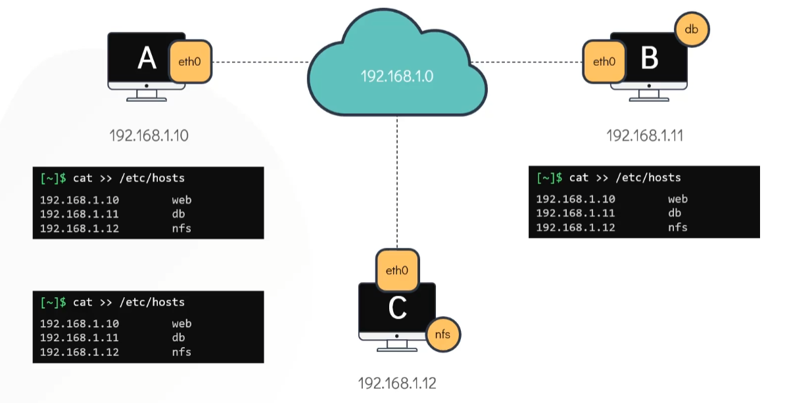

그러나 여러 대의 컴퓨터를 연결한다고 했을 때, 변경 사항이 생길 때 마다 각 컴퓨터의 hosts 파일을 수정하는 것은 매우 번거로운 작업이 될 것이다. 따라서 Domain Name을 가지고 있는 하나의 Server를 만든다면 Domain Name으로 접근할 때 해당 Server를 참고하면 이러한 수고를 줄일 수 있을 것이다. 이런 Domain Name을 관리해주는 시스템을 Domain Name System, DNS라고 부른다.

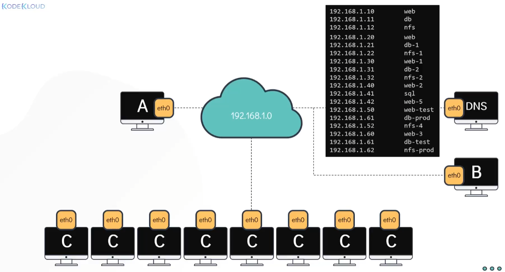

그렇다면 이 DNS 서버를 어떻게 알고 사용할 수 있을까? `/etc/resolv.conf` 에 nameserver의 IP가 설정되어 있다. 컴퓨터가 Domain Name을 찾아가는 순서는 기본적으로 hosts file → DNS 이다. 이 순서는 `/etc/nsswitch.conf` 에 정의되어 있으며, 순서는 변경이 가능하다.

공개적인 DNS 서버로는 Google이 운영중인 `8.8.8.8` 이라는 네임서버가 있다. 만약 hosts file과 운영중인 DNS 서버 모두 일치하는 Domain Name을 찾지 못한 경우, DNS 서버에서 Forward All to IP 를 추가하여 다른 DNS 서버로 Redirect 할 수 있다.

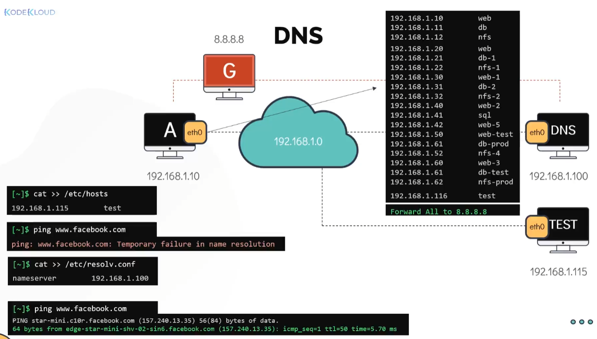

- Domain Names

    Domain Name은 특정 규칙에 의해 정의된다.

    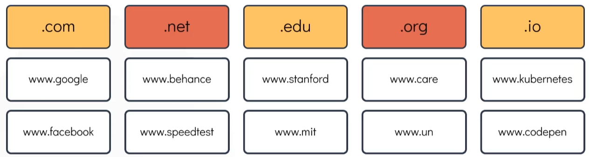

    Domain Name은 다음과 같은 구조를 가지고 있다.

    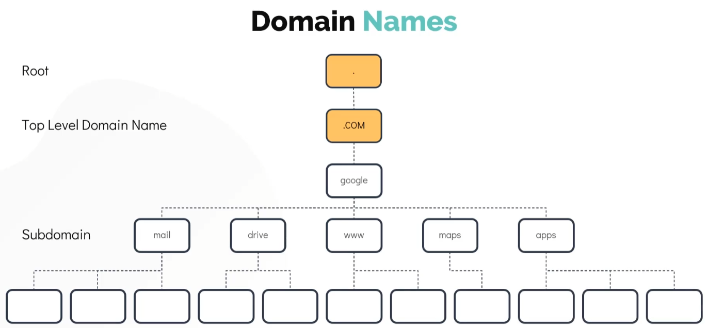

    `[google.com](http://google.com)` 이라는 도메인을 가지고 있으면 mail, drive, maps 등 여러 개의 Subdomain을 가질 수 있다. 만약 `[apps.google.com](http://apps.google.com)` 에 접속을 시도하면 다음과 같은 순서로 IP 주소를 얻어 접속하게 된다. 좀 더 빠른 접근을 위해 Local DNS에서 Cache를 사용하기도 한다.

    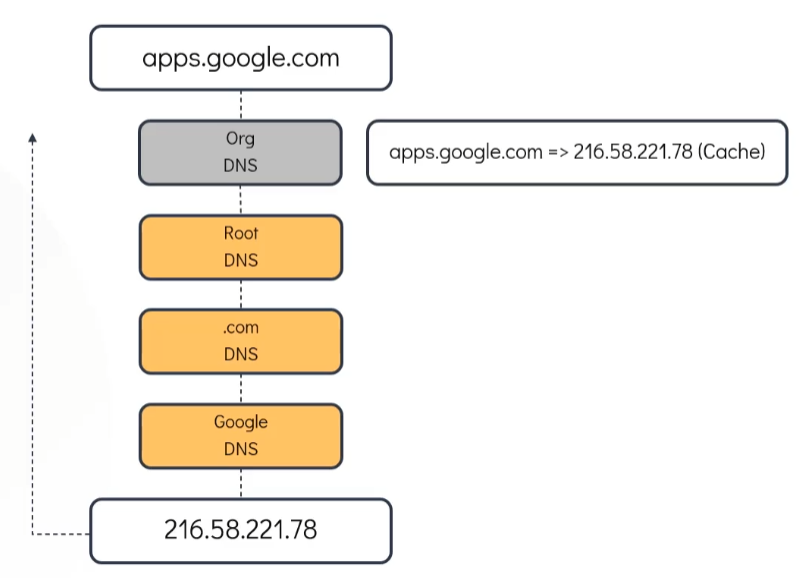

    여러 개의 Subdomain을 사용할 때, 서버 내부에서의 접근과 외부에서의 접근 Name이 다를 수 있다. 이럴 경우에 `/etc/reslov.conf` 를 적절하게 수정한다면 유용하게 사용할 수 있다.

    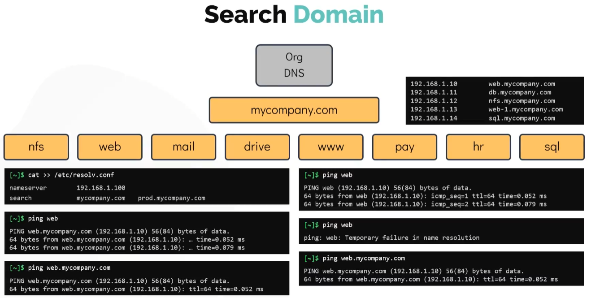

- Record Types
    - A : name to IPv4
    - AAAA : name to IPv6
    - CNAME : name to name

    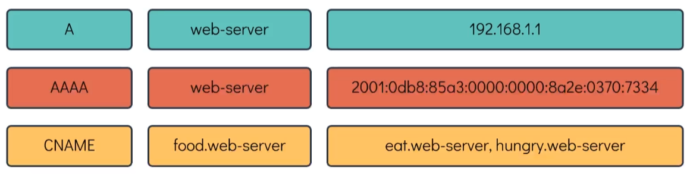

- nslookup : 명령어를 이용하여 DNS Server에 hostname을 요청할 수 있다. 단, `/etc/hosts` 파일은 고려하지 않는다.
- dig : DNS를 상세하게 분석할 수 있다.

### Networking Basics

- Switch
    - host 간의 통신이 가능하도록 연결해주는 장치

    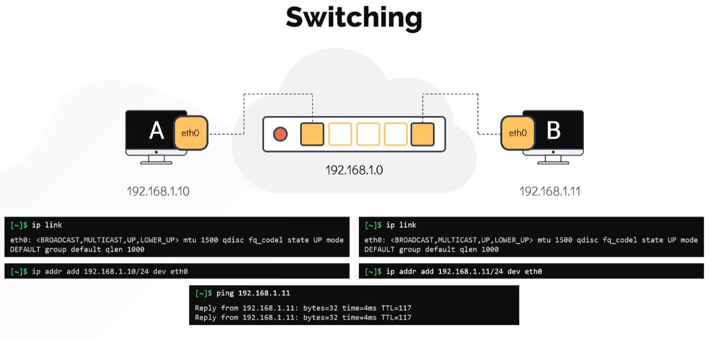

- Router
    - 네트워크 간의 경로를 설정하고 목적지에 맞게 패킷을 보내주는 장치

    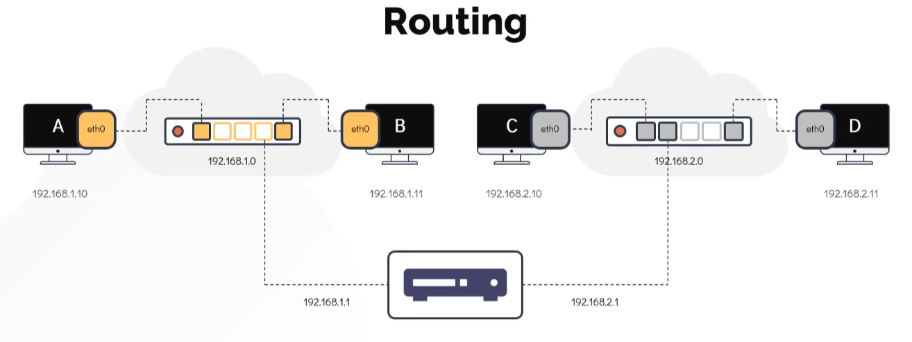

- Gateway
    - 외부와의 통신을 위한 관문. 내부의 Routing Table에 정의되어 있지 않은 패킷은 모두 게이트웨이로 보내진다. 일반적으로 `x.x.x.1` 로 정의된다.
    - `route` 명령어를 통해 현재 routing table을 확인할 수 있다.
    - 192.168.1.0/24 의 host가 192.168.2.0/24 와 통신을 하기 위해서 `ip route add 192.168.2.0/24 via 192.168.1.1` 와 같이 라우팅 규칙을 추가해주어야 한다.

        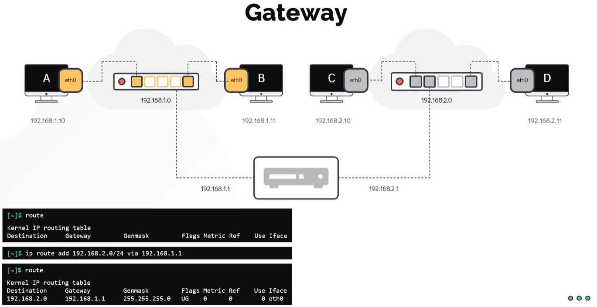

    - Default Gateway

        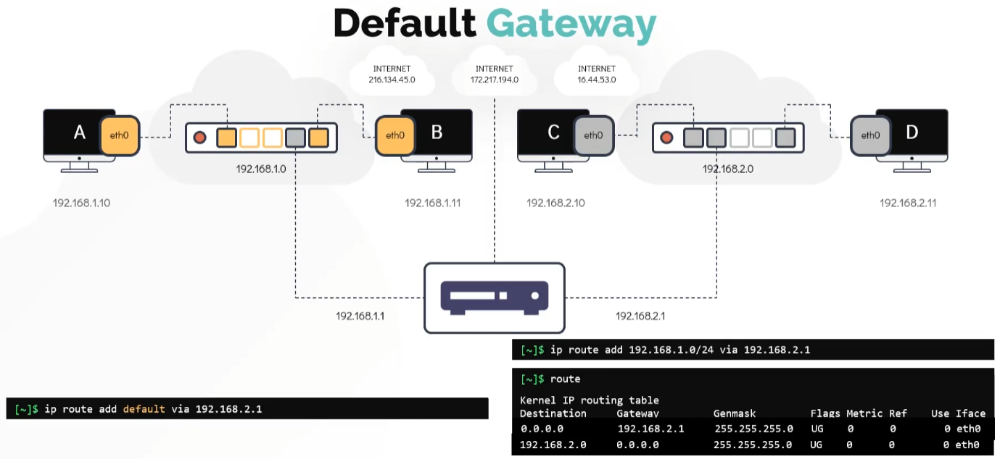

    - 관련 Command
        - `ip link` : host에 적용된 interfaces list를 출력한다.
        - `ip addr` : 각 IP 주소에 할당된 interfaces를 출력한다.
        - `ip addr add 192.168.1.10/24 dev eth0` : interface에 IP를 할당한다. 재부팅 후 적용된다.  해당 설정을 영구적으로 적용시키고 싶을 경우에 `/etc/network/interfaces` 파일에 설정한다.
        - `ip route or route`
        - `ip route add 192.168.1.0/24 via 192.168.2.1` : routing table에 규칙을 추가한다.
        - [Cheat Sheet](https://access.redhat.com/sites/default/files/attachments/rh_ip_command_cheatsheet_1214_jcs_print.pdf)

### Troubleshooting

네트워크에 문제가 생겼을 때 여러가지 경우가 있을 수 있다. Local interface에 문제가 있거나, Host의 IP 주소가 resolve 되지 않았거나, Router에 문제가 있을 수도 있으며, 서버 자체에 문제가 있을 수도 있다. 이렇게 네트워크에 관련된 여러가지 문제가 발생했을 때 해결하는 방법을 알아보자.

1. Check Interfaces

    `ip link` 명령어를 통해 먼저 interface가 제대로 작동하고 있는지 확인한다. status 부분에 UP으로 표시되어 있으면 제대로 작동하고 있다고 볼 수 있다.

2. Check DNS Resolution

    `nslookup hostname` 명령어를 통해 서버의 IP를 제대로 받아오는지 확인한다. 서버의 IP를 제대로 받아온다면 DNS는 정상적으로 작동하고 있다고 볼 수 있다.

    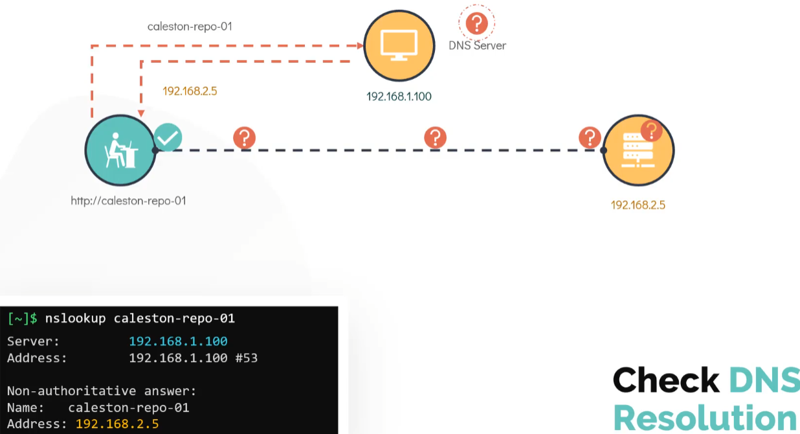

3. Check Connectivity

    `ping` 명령어를 통해 서버로 패킷을 보냈을 때, 패킷이 정상적으로 도달하지 않는다면 서버와 시스템 사이에 문제가 있다고 추측해볼 수 있다.

    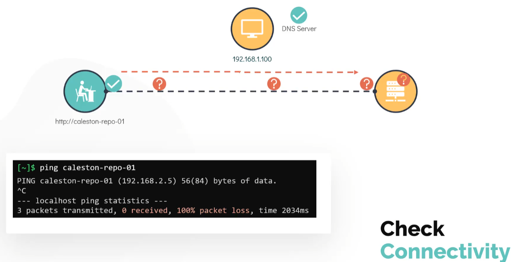

4. Check Route

    `traceroute` 명령어를 통해 Routing 하는 과정에서 Router에 문제가 없는지, 어디서 문제가 발생하는지 확인해본다.

    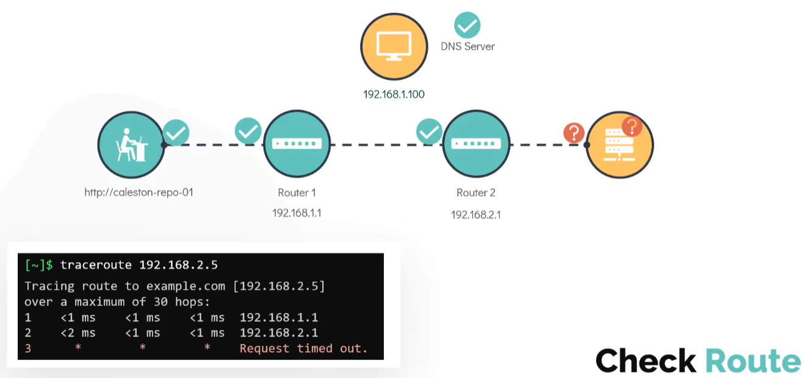

5. Check Service

    `netstat` 명령어를 이용해 현재 문제가 발생하는 것으로 예상되는 서비스를 조회해본다.

    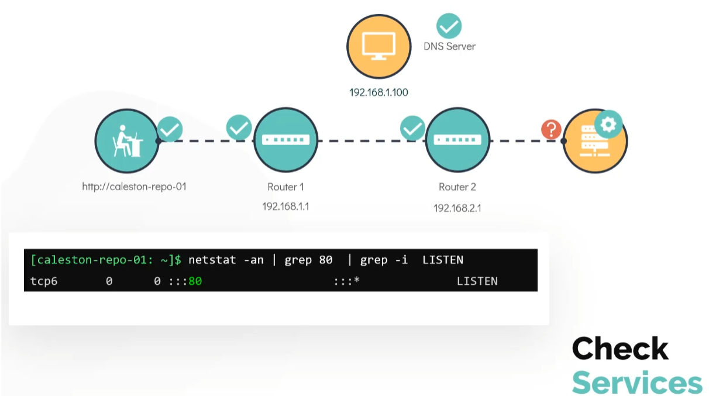

6. Check Interfaces

    `ip link` 명령어를 통해 서버의 Interfece를 확인한다.

    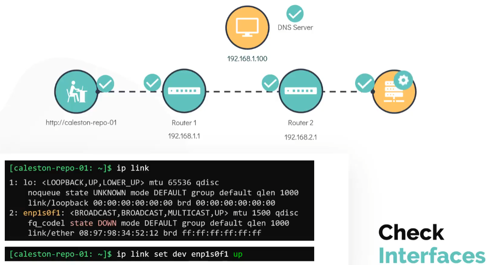

    ## Storage in Linux

    ### Disks and Partitions

    - Block Devices : HDD나 SSD 같은 물리적인 Device를 말한다.
        - `lsblk` 또는 `ls -l /dev/ | grep "^b"` 명령어로 조회할 수 있다.
        - 하나의 Disk는 여러 개의 Partition으로 나눠질 수 있다.
        - Device Type에 따라 다른 Major Number를 가진다.

        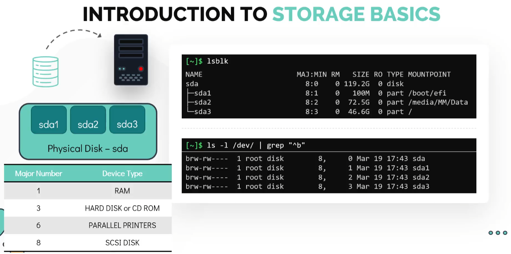

        - `sudo fdisk -l /dev/sda` 명령어로 더 상세한 정보를 얻을 수 있으며 Disk의 추가, 삭제도 가능하다.
    - Partition Types
        - Primary Partition : 파티션에 부트섹터가 할당되어 OS를 설치할 수 있는 파티션. 하나의 디스크에 최대 4개의 Primary Partition(주 파티션)을 만들 수 있다.
        - Extended Partition : 실제로 사용되는 파티션이 아닌 Logical 파티션을 사용하기 위한 파티션. 하나의 Disk에 하나의 Extended Partition(확장 파티션)을 만들 수 있다.
        - Logical Partition : 논리 영역 파티션으로 데이터를 저장하는 파티션이다.
    - Partition Scheme
        - Master Boot Record(MBR)
            - 최대 4개의 Primary Partition 생성 가능
            - 최대 2TB의 디스크 사이즈
        - GUID Partition Table(GPT)
            - 무제한 Primary Partition 생성 가능
            - 디스크 사이즈 제한 없음
    - Creating Partitions
        - `gdisk`
            - Disk Partitioning 가능
            - `fdisk`의 개선 버전
            - GPT Partition Table로 작동
            - `n` 명령어로 파티션을 생성하고, `w` 명령어로 해당 테이블을 disk에 적용한다.

            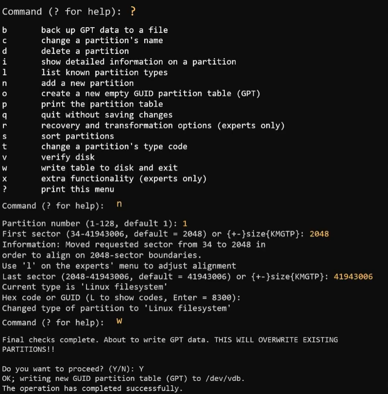

    ### File Systems in Linux

    Partition Disk만 가지고서는 파일을 읽고 쓸 수 없다. 따라서 Filesystem을 만들고 Mount해야 데이터를 읽고 쓸 수 있게 된다.

    - Linux Filesystem
        - EXT2
            - 2TB File size
            - 4TB volume size
            - Supports Compression
            - Supports Linux Permission
            - Long Crash Recoery
        - EXT3
            - 2TB File size
            - 4TB volume size
            - Uses Journal
            - Backwards Compatible
        - EXT4
            - 16TB File size
            - 1 Exabyte
            - Uses Journal
            - Uses chksum for journal
            - Backwards Compatible
    - Creating EXT4
        - `mkfs.ext4 /dev/sdb1` : ext4 type으로 Filesystem 설정
        - `mkdir /mnt/ext4;` : 마운트 할 디렉토리 생성
        - `mount /dev/sdb1 /mnt/ext4` : 파일시스템 마운트
        - `mount | grep /dev/sdb1` : 마운트 확인
        - `df -hP | grep /deb/sdb1` : 마운트 확인
    - fstab
        - `/etc/fstab` : 부팅 시 해당 파일에 있는 file system을 등록한다.

        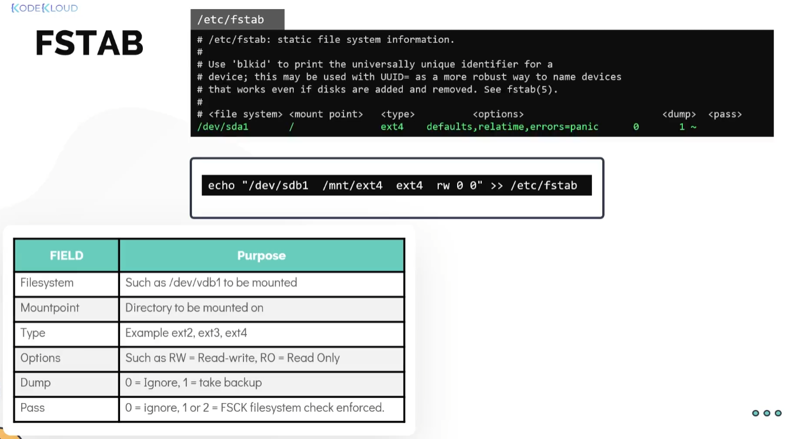

    - `blkid` : sudo 권한으로 실행하여 Block Device의 UUID, TYPE을 출력한다.

    ### DAS NAS and SAN

    - DAS : Direct Attached Storage
        - Block Storage
        - Fast and Reliable
        - Affordable
        - Dedicated to single host
        - Ideal for small businesses

        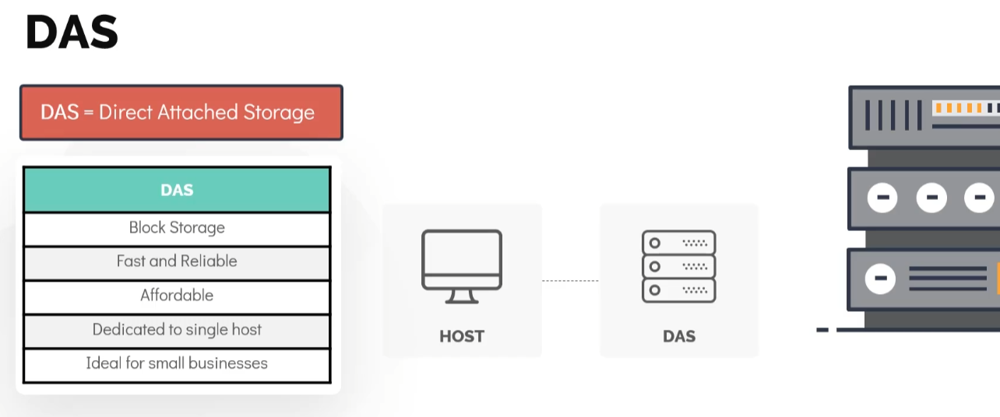

    - NAS : Network Attached Storage
        - NFS / CIFS
        - Reasonably Fast and Reliable
        - File Based Storage
        - Shared Storage
        - Not suitable for OS install

        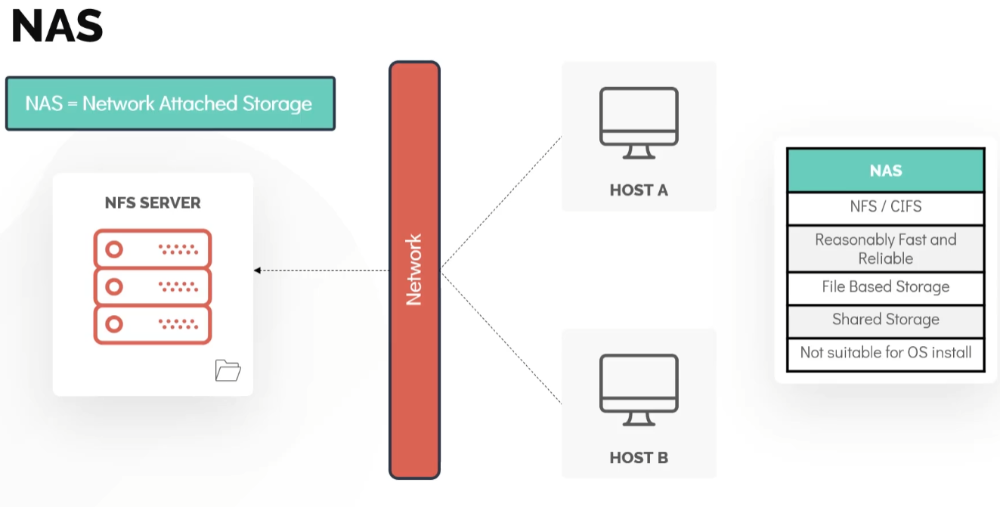

    - SAN : Storage Area Network
        - FC or iSCSI
        - Block Storage
        - Fast, Secure and Reliable
        - High Availability
        - Expensive

        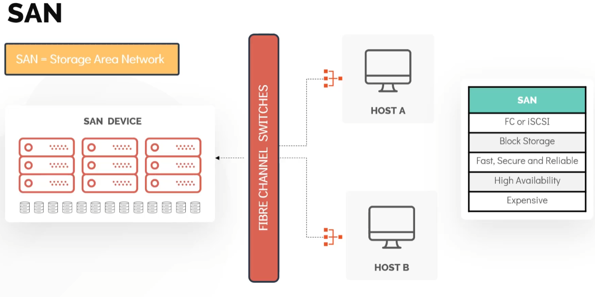

    ### NFS

    NFS는 Client/Server형 응용프로그램으로, 여러 Client가 Server의 Disk를 마치 자신의 Disk에 Mount 된 것 처럼 사용할 수 있다.

    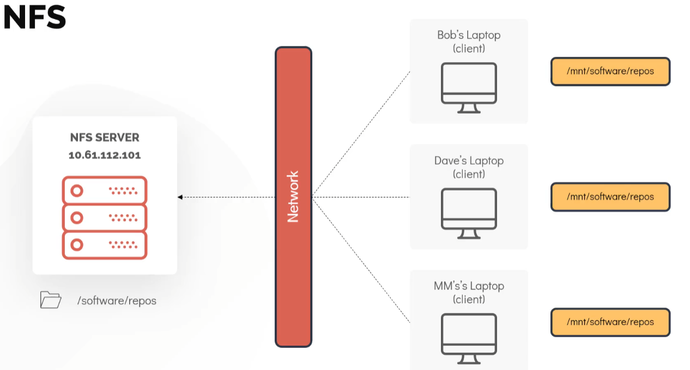

    NFS는 Server 에서 `/etc/exports` 파일에 설정할 수 있다. IP는 range로도 설정 가능하며, `*` 를 사용한 표현도 가능하다.

    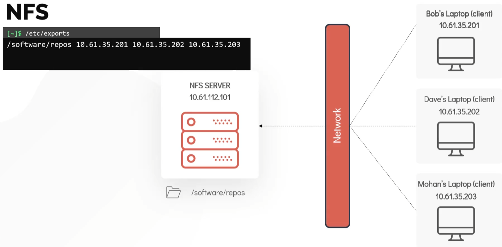

    Server에서 `/etc/exports` 파일에 마운트 규칙을 설정하고 `exportfs` 명령어를 통해 해당 리스트를 갱신하고 nfs 서비스를 실행한다. Client는 `mount` 명령어를 통해 NFS Server의 디렉토리에 마운트 한다. 

    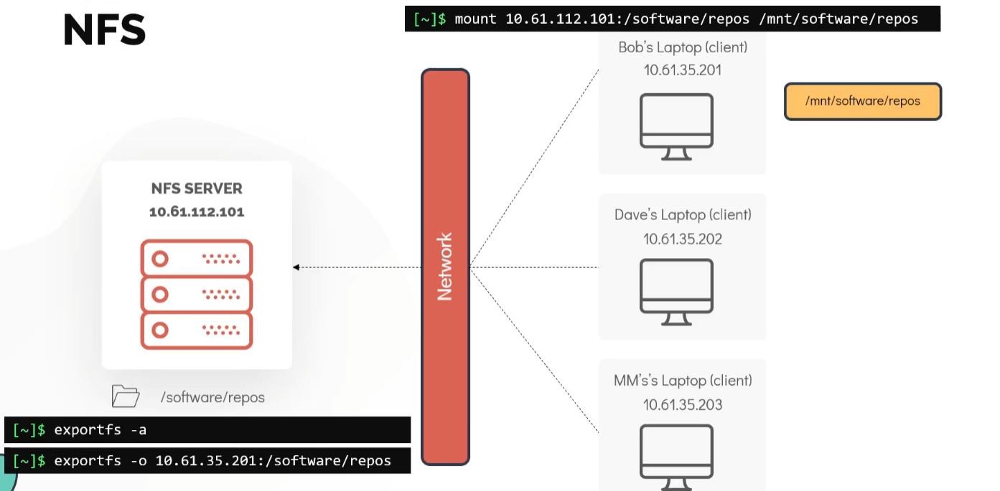

### LVM (Logical Volume Manager)

LVM은 여러 개의 물리적 Volume를 하나의 Group으로 묶어서 관리한다. 이렇게 관리하게 되면 해당 볼륨 그룹 안에서 논리적으로 새로운 볼륨을 만들어 볼륨의 크기를 변경하는 것이 쉽게 가능해진다.

LVM을 사용하기 위해서는 `lvm2` 를 별도로 설치해야 한다. 설치 후 LVM을 설정하는 과정은 다음과 같다.

1. Physical Volume(PV) 생성

    `pvcreate /dev/sdb`

    `pvdisplay` : 상세 정보 확인

2. Volume Group(VG) 생성

    `vgcreate vg_name /dev/sdb`

    `vgdisplay`

    VG에는 여러 개의 PV를 하나의 Group으로 만들 수 있다.

    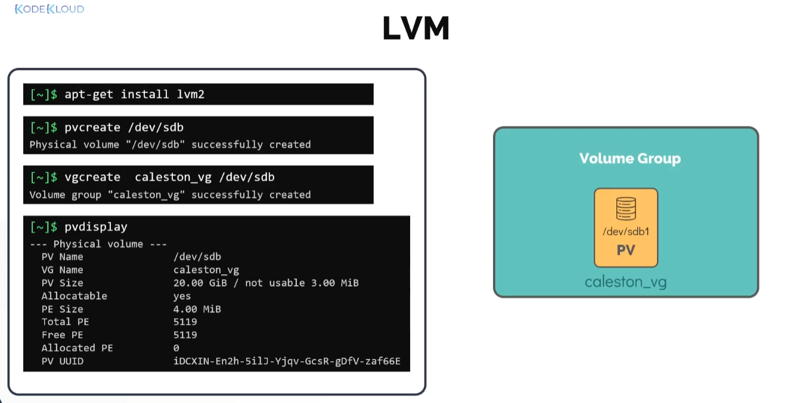

3. Logical Volume(LV) 생성

    `lvcreate -L 1G -n vol1 vg_name`

    `lvdisplay`

    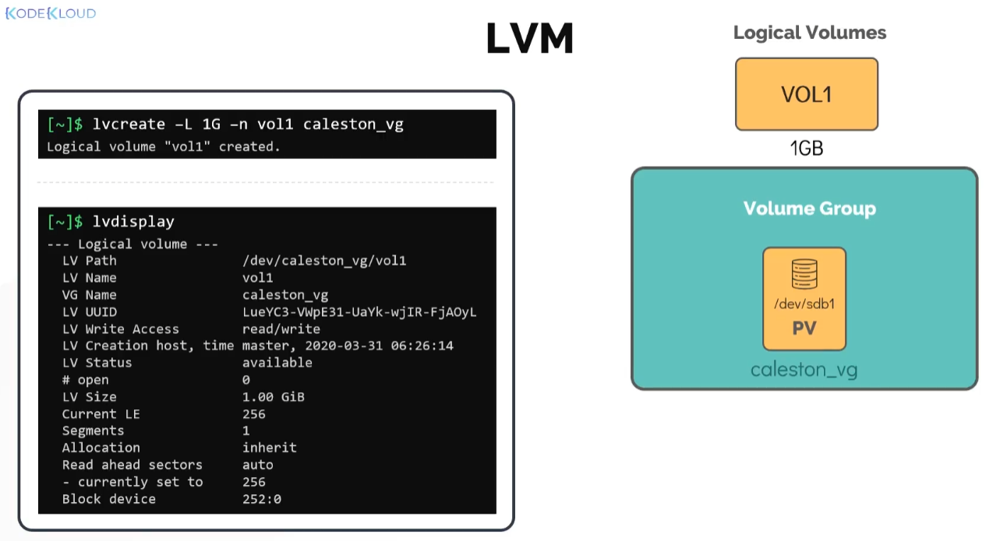

4. File System 생성 후 Mount

    `lvs` : 생성한 LV, VG 확인

    `mkfs.ext4 /dev/vg_name/vol1`

    `mount -t ext4 /dev/vg_name/vol1 /mnt/vol1`

    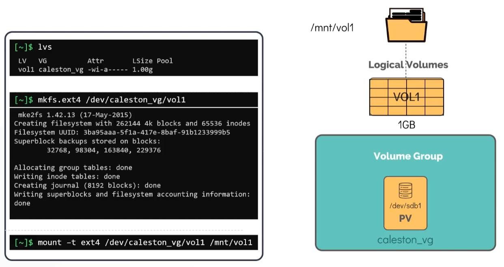

5. Resize

    File System에서는 Volume의 Resize가 불가하지만, LVM에서는 가능하다.

    `vgs` : Volume Group 출력

    `lvresize -L +1G -n /dev/vg_name/vol1`

    `df -hP /mnt/vol1`

    확인해보면 아직 File System의 사이즈는 늘어나지 않았다. 왜냐하면 Logical Volume의 크기만 늘렸을 뿐, 아직 File System에 적용하지 않았기 때문이다.

    `resize2fs /dev/vg_name/vol1` 명령어를 통해 File System도 늘려준다.

    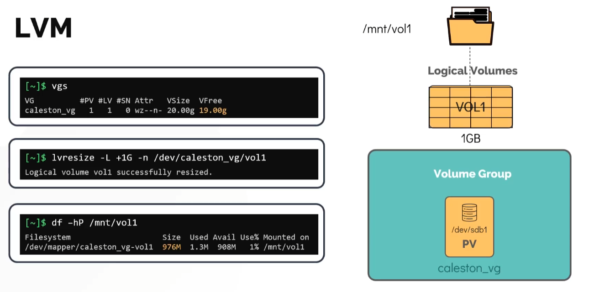

    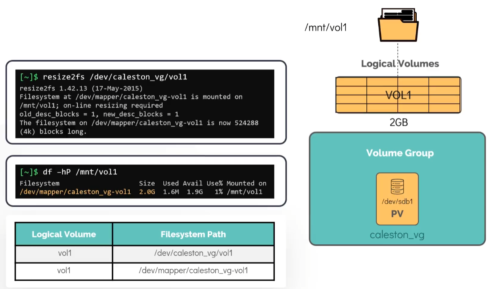

    Logical Volume은 `/dev/mapper/vg_name/vol1` 으로도 접근 가능하다.
