# Linux

- foreground / background
    - `sudo -s` : 관리자 권한 얻기
    - `jobs -l` : 중지된 프로세스 확인
    - `bg [process id]` : background로 실행하기
    - `fg [process id]` : foreground로 실행하기
    - command 뒤에 `&`를 붙이면 background 로 실행할 수 있다.
- `dig +trace [url]` : DNS trace util

## Working with the Shell

- `pushd / popd` : 현재 디렉토리를 stack에 저장해둘 수 있다.
- `type` : 해당 명령어의 type을 확인할 수 있다.
- help command
    - `whatis` : display one-line manual page descriptions
    - `man` : an interface to the system reference manuals
    - `apropos` : search the manual page names and descriptions
- `chsh` : 로그인 Shell 변경 가능
- `echo $PS1` : 로그인 정보가 담겨있는 환경변수
    - `PS1="something"` 으로 변경할 수 있다

    

## Linux Core Concepts

### Linux Kernel

- Kernel이란?

    도서관에서 학생들이 도서관에 있는 책들을 사서를 통해 빌려가고 하는 것 처럼 커널은 컴퓨터 하드웨어 자원과 소프트웨어 사이에서 효율적인 동작을 위해 존재하는 중개자 같은 역할이다.

    커널의 역할은 크게 다음과 같이 나눌 수 있다.

    1. Memory Management
        - Kernel Space
            - Kernel Code
            - Kernel Extensions
            - Device Drives
        - User Space
            - Application / Programs (C, Java, Python etc.)
    2. Process Management
    3. Device Drivers
    4. System Calls ans Security

### Linux Hardware

- `uname` : 커널의 정보를 알려준다.
    - `uname -r or -a` : 커널의 버전을 알려준다.
- `dmesg` : 커널 영역의 메세지를 출력한다.
- `udevadm` : udev 관련 정보를 출력한다.
    - `udevadm info --query=path --name=/dev/sda5`
    - `udevadm monitor`
- `lspci` : PCI 목록을 출력한다.
- `lsblk` : Block Devices를 출력한다.
- `lscpu` : CPU 정보를 출력한다.
- `lsmem --summary` : 메모리 정보를 출력한다.
- `free` : 사용중인 메모리 정보를 출력한다.
- `lshw` : 하드웨어 정보를 출력한다.

### Linux Boot

1. BIOS POST : 우리가 흔히 보는 바이오스 화면
2. Boor Loader(GRUB2) : HDD or SSD에 있는 부트로더에서 부팅할 OS를 불러온다.
3. Kernel Initialization : Kernel Load, init process 생성
4. INIT Process(systemd) : daemon process 생성

### Runlevels

- CLI
- GUI
- `runlevel`
    - 3 : Boots into a Command Line Interface → multiuser.target
    - 5 : Boots into a Graphical Interface → graphical.target
- `systemctl get-default`
- `ls -ltr /etc/systemd/system/default.target` 조회
- `systemctl set-default multi-user.target` 으로 변경 가능
- graphical에서 multi-user로 변경할 시 runlevel을 5에서 3으로 바꾸는 것과 같다.

### File types

- Regular File
    - Images
    - Scripts
    - Configuration / Data Files
- Directory
    - /home
    - /root
- Special Files
    - Character Files
    - Block Files
    - Links
        - Hard Links
        - Symbolic Links
    - Sockets Files
    - Named Pipes
- `file` : 해당 file의 type을 출력한다.
- `ls -l` 명령어로도 확인할 수 있다.

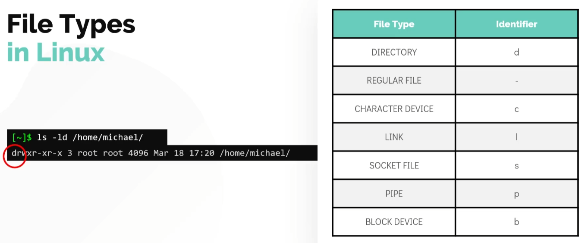

### Filesystem Hierarchy

- /root
    - `/bin` : Basic Program Binary
    - `/boot`
    - `/dev` : Devices, external HDD, external file, etc.
    - `/etc` : Linux의 대부분의 Configuration file
    - `/home` : 사용자들의 Home Directory
    - `/lib` : shared library
    - `/media` : USB Drive와 같은 external media
    - `/mnt` : 마운트
    - `/opt` : Thrid-party program이 install되는 곳
    - `/tmp` : 임시 마운트
    - `/usr` : 옛날의 Linux System에서의 User Home Directory
    - `/var` : log and cached data

## Package management

### Package managers

- dpkg / apt / apt-get : Ubuntu, Debian 계열
- RPM / yum / dnf : RHEL, CentOS 계열

패키지 매니저의 기능

1. Package Integrity and Authenticity
2. Simplified Package Management
3. Grouping Packages
4. Manage Dependencies

### RPM and YUM

RedHat, CentOS, Fedora와 같은 OS에서 사용

- RPM
    - Installation : `rpm -ivh package.rpm` 패키지 설치
    - Uninstalling : `rpm -e package.rpm` 패키지 제거
    - Upgrade : `rpm -Uvh package.rpm` 패키지 업그레이드
    - Query : `rpm -q package.rpm` 패키지 정보 조회
    - Verifying : `rpm -Vf <path to file>` 패키지 검증
    - RPM은 Dependency 관리를 해주지 않는다.
- YUM : Yellowdog Updater, Modified
    - RPM Based Distros
    - Software Repositories : `/etc/yum.repos.d` 에 파일로 저장
    - High Level Package Manager
    - Automatic Dependency Resolution
    - `yum install package` : 패키지 설치. `-Y` flag로 설치 응답을 무시할 수 있다.
    - `yum repolist` : Repository list 조회
    - `yum provides package` : 패키지 설치 정보 조회
    - `yum remove package`  : 패키지 제거
    - `yum update package` : 패키지 업데이트. 패키지를 지정하지 않을 시 모든 패키지를 업데이트한다.

### DPKG and APT

Ubuntu, Debien, PureOS 등에서 사용

- DPKG : RPM과 비슷한 Low-level 패키지 매니저
    - Installation / Upgrade : `dpkg -i package.deb`
    - Uninstallation : `dpkg -r package.deb`
    - List : `dpkg -l package.deb`
    - Status : `dpkg -s package.deb`
    - Verifying : `dpkg -p <path to file>`
- APT / APT-GET
    - `apt install package` or `apt-get install package` : 패키지 설치
    - `apt remove package` : 패키지 제거
    - `apt search package` : 패키지 조회
    - `apt list | grep package` : 현재 설치된 패키지에서 조회
    - `/etc/apt/sources.list` : Software Repository
    - `apt update` : 패키지 정보 업데이트
    - `apt upgrade` : 설치된 패키지 업데이트
    - `apt edit-sources` : 소스파일 편집
- APT vs APT-GET
    - Install 할 때 보여지는 정보가 다름

    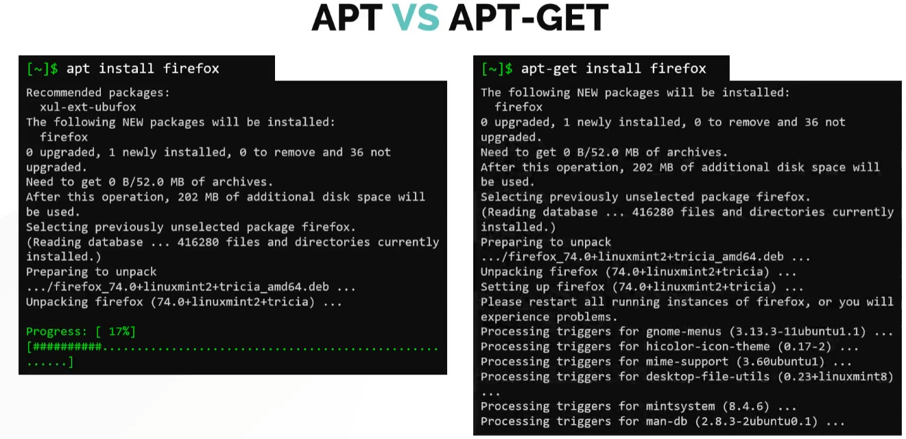

    - 패키지를 조회할 때 명령어가 다름
        - `apt search package` vs `apt-cache search package`

        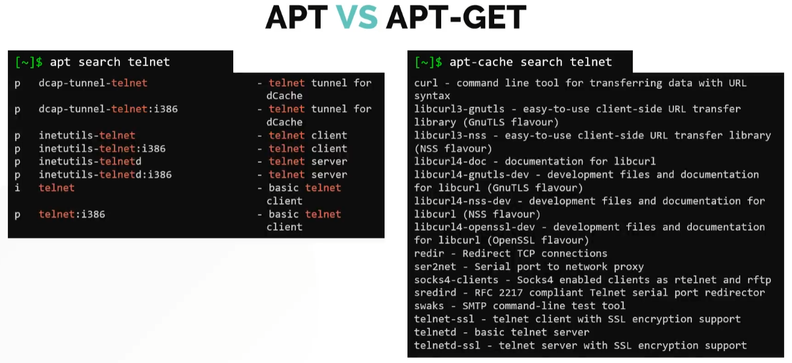

## Working with the Shell 2

- `du -sk file`  : Disk Usage
    - -k flag : kilo
    - -h flag : Human-Readable
- `ls -lh`
- `tar` : 파일 아카이빙
    - `tar -cf test.tar file1 file2 file3` : 파일 압축
    - `tar -tf test.tar` : 압축된 리스트 확인
    - `tar -xf test.tar` : 압축 해제
    - `tar -zcf test.tar file1 file2 file3` : 파일 압축(compressing)
- Compressing
    - bzip2 ↔ bunzip2
    - gzip ↔ gunzip
    - xz ↔ unxz
- zcat / bzcat / xzcat

### Searching for Files and Directories

- `locate` : 별도의 DB를 만들어 파일을 관리. 빠르다.
    - `updatedb` : locate db를 업데이트
- `find` : 주어진 조건에 따라 파일을 찾는다.
- `grep` : 주어진 문자열을 검색
    - `-i` : 대소문자 구분하지 않음
    - `-r` : recursive. 폴더에서 검색
    - `-v` : not matching
    - `-w` : 정확히 매칭되는 문자열만 검색
    - `-An` : 처음으로 일치하는 패턴 + n줄
    - `-Bn` : 마지막으로 일치하는 패턴 + n줄

### I/O Redirection

- Standard Input
- Standard Output
    - Redirect `>` : 해당 output을 print하는 대신에 파일로 출력
    - Redirect `>>` : 해당 파일에 추가

    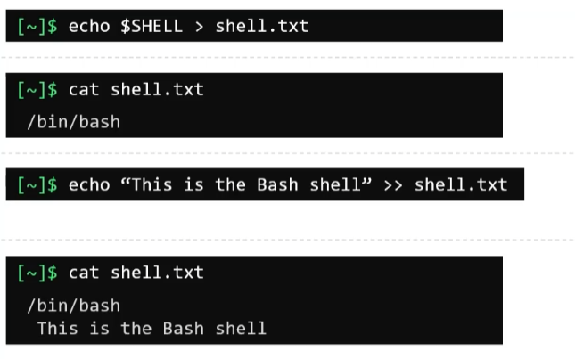

- Standard Error
    - Redirect `2>` : stderr는 fd가 2이기 때문에 redirection 기호 앞에 stderr를 명시할 수 있다.
    - 해당 에러가 필요하지 않아 버리고 싶을 때는 `/dev/null`로 redirect 한다.

    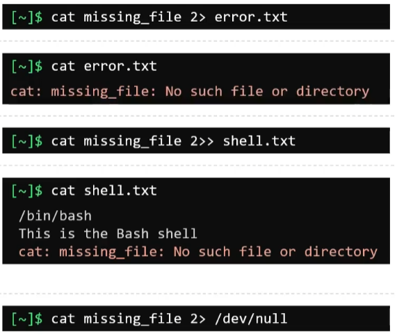

- Pipes : 여러개의 명령어를 연결해준다.
    - `command1 | command2` 에서 command1의 Output을 command2의 Input으로 연결해준다.

## Security and File Permissions

### Linux Accounts

- Linux Security
    - Access Controls : Password based Authentication
    - PAM(Pluggable Authentication Model) : Program and Services Authentication
    - Network Security : such as Firewall
    - SSH Hardening : Remote access to a server
    - SELinux : Makes use of security policies
- User : 유저마다 고유의 UID를 가진다. `/etc/passwd` 에 저장. `id user` 로 조회할 수 있다.
    - username : 유저의 name
    - UID : 유저의 고유한 ID
    - GID : 유저가 속한 Group ID. 여러 개 일 수 있다. 처음 생성된 유저는 자신의 UID와 같은 GID를 가진다.
    - Home Directory : 유저의 Home Directory
    - Default Shell : 유저의 기본 실행 Shell
- Group : 유저를 기반으로 만든 그룹으로 GID를 가진다. `/etc/group` 에 저장
- Account Types
    - User Account : 유저
    - Superuser Account : 슈퍼유저. UID = 0
    - System Accounts : ssh, mail과 같은 시스템 계정. UID < 100 or 500 ~ 1000
    - Service Accounts : nginx와 같은 서비스 계정
- Command
    - `id` : id 조회
    - `who` : 현재 접속한 유저 조회
    - `last` : 부팅 이후의 모든 유저의 로그인 기록
    - `su -` : Switching User
    - `sudo` : Superuser do. 슈퍼유저는 `/etc/sudoers` 에 설정되어 있다.

        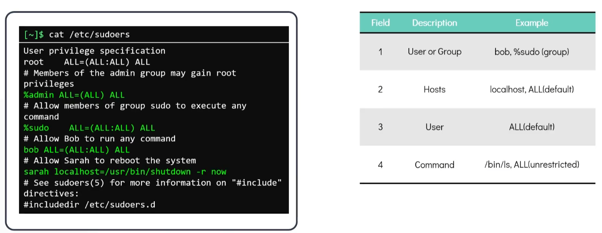

### User Management

- `useradd name` : 유저 추가
    - -u : specific UID
    - -g : specific GID
    - -d : custom home directory
    - -s : specify login shells
    - -c : Custom Comments
    - -e : Expiry Date
    - -G : Create user with multiple secondary groups
- `passwd name` : 유저의 패스워드 변경
- `whoami` : 현재 로그인 된 유저 확인
- `userdel name` : 유저 삭제
- `groupadd -g GID username` : 유저를 그룹에 추가
- `groupdel groupname` : 그룹 삭제

### Access Control Files

- `/etc/passwd` : 모든 유저의 정보가 저장되어 있다. 기본적으로 누구나 읽을 수 있지만 수정은 root 유저만 가능하며, 일반 text editor로 편집할 수 없다.

    `USERNAME:PASSWORD:UID:GID:GECOS:HOMEDIR:SHELL`

- `/etc/shadow` : 유저의 Password가 Hash로 암호화되어 저장되어 있다.

    `USERNAME:PASSWORD:LASTCHANGE:MINAGE:MAXAGE:WARN:INACTIVATE:EXPDATE`

- `/etc/group` : 그룹들이 저장되어 있다.

    `NAME:PASSWORD:GID:MEMBERS`

### File Permissions and Ownership

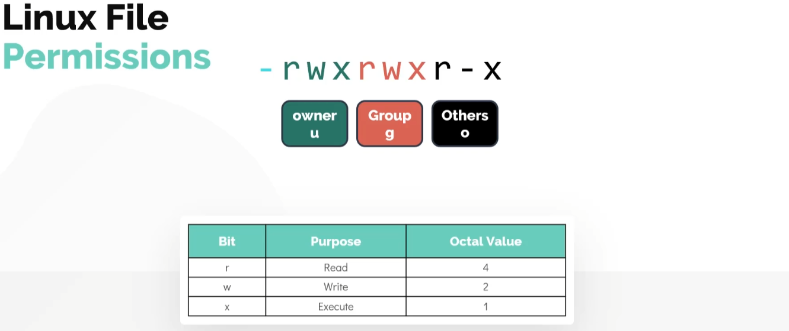

- `ls`는 읽기 권한이 필요하지만, `cd`는 실행 권한이 필요하다.
- 리눅스에서는 권한을 owner, group, others 순차적으로 확인한다. 예를 들어, owner와 group이 같은 유저일 때, group과 others에 모든 권한이 있어도 owner의 권한이 없으면 접근이 금지된다.

    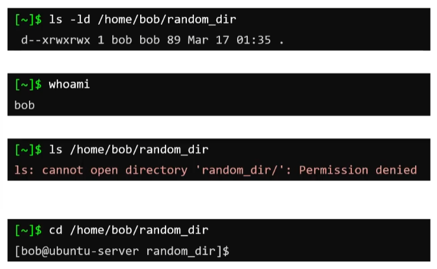

- `chmod <permissions> file` : 파일의 권한 변경
- `chown` : 소유자 변경
    - `chown hyulee:developer file` : 파일의 소유자를 hyulee로 변경하고, 그룹을 developer로 변경한다.
    - `chown hyulee file` : 파일의 소유자만 hyulee로 변경한다.
    - `chgrp developer file` : 파일의 그룹을 developer로 변경한다.

### SSH and SCP

- SSH는 22번 포트를 사용한다.
    - `ssh <hostname or IPAddress>`
    - `ssh <user>@<hostname or IPAddress>`
    - `ssh -l <user> <hostname or IPAddress>`
    - 유저를 지정하지 않을 시, 현재 로그인 되어있는 유저로 접속을 시도한다.
- Password-Less SSH
    - Private key와 Public key를 이용하여 패스워드 없이 로그인할 수 있다.
    - `ssh-keygen -t rsa` 로 키를 생성한다
    - Public key는 `/home/.ssh/id_rsa.pub` 에 저장된다.
    - Private key는 `/home/.ssh/id_rsa` 에 저장된다. Private key는 절대 타인에게 노출되어서는 안된다.
    - `ssh-copy-id <user>@<hostname or IPAddress>` 로 키를 복사한다. 해당 정보는 Server의 `/.ssh/authorized_keys` 에 저장되어 있다. Public key를 수동으로 해당 파일에 붙여넣어도 된다.
- SCP (Secure Copy)
    - SSH를 이용한 copy
    - `scp file <hostname or IPAddress>:<hostpath>`
    - 해당 폴더에 쓰기 권한이 있어야 한다.
    - 폴더 안의 모든 파일을 전송하고 싶을 경우엔 `-r` 옵션을 사용한다.
    - `-p` 옵션을 사용하면 전송 상태를 상세하게 확인할 수 있다.

### IP Tables Rules

- IPTables는 리눅스 시스템에서 방화벽을 설정하기 위한 프로그램이다.

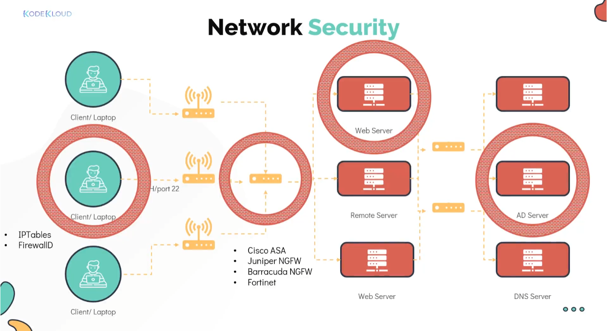

- RedHat이나 CentOS는 IPTables가 기본적으로 설치되어 있지만, 우분투는 수동으로 설치해주어야 한다.
- `sudo apt install iptables` 로 설치한다.
- `sudo iptables -L` : 현재 설정되어있는 policy의 List를 출력
- Input Chain : Server로 들어오는 패킷
- Output Chain : Server에서 나가는 패킷
- Forward Chain : route 역할. 패킷을 다른 곳으로 전달
- Chain이라고 부르는 이유는 선언된 규칙을 순서대로 확인하기 때문

### Securing the Environment

- 규칙은 위에서부터 순서대로 적용되기 때문에 ACCEPT 규칙을 먼저 선언한 후 DROP 규칙을 선언하는 것이 좋다. 만약 DROP 규칙을 선언한 이후에 ACCEPT 규칙을 선언하고 싶다면 -I 옵션을 이용하면 가장 위에 규칙을 추가할 수 있다.
- 규칙은 가장 위에서 1번부터 시작한다.
- `-A` : Add Rule
    - `iptables -A INPUT -p tcp -s ip_address --dport 22 -j ACCEPT`
    - `iptables -A INPUT -p tcp --dport 22 -j DROP`
- `-I` : Inserts the rule to the top of the chain
    - `iptables -I OUTPUT -p tcp -d ip_address --dport 443 -j ACCEPT`
- `-D` : Delete Rule
    - `iptables -D OUTPUT 5`
- `-p` : Protocol
- `-s` : Source
- `-d` : Destination
- `--dport` : Destination port
- `-j` : Action to take

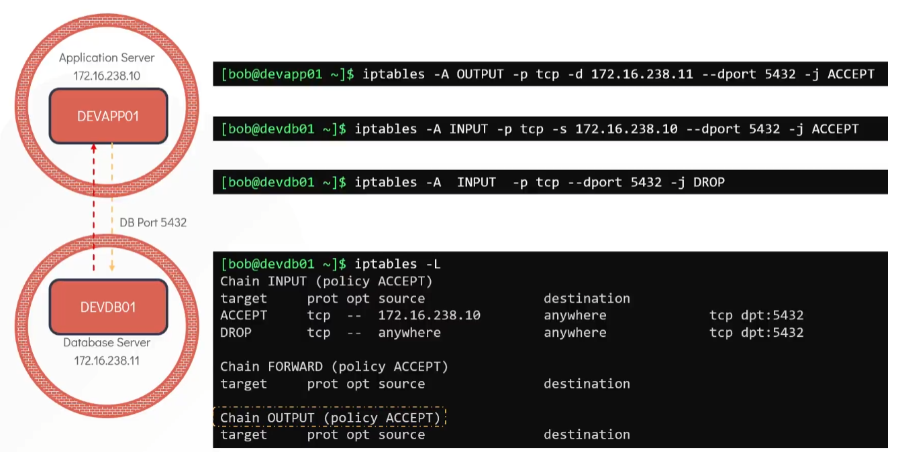

- DB에서 AppServer에 Request에 대한 Response를 할 땐 Ephemeral Port를 이용하여 통신한다. 따라서 항상 같은 Port로 Response를 받을 수 있다는 보장이 없다.
- Ephemeral Port는 일반적으로 32768 ~ 60999 사이의 범위로 지정되어 있다.

### Cronjobs

- 특정 시간에 반복되는 작업을 하고 싶을 땐 Cronjob을 이용하면 해결할 수 있다.
- Cronjob은 `crond` 라는 데몬프로세서에 의해 실행된다.
- `crontab -e` : Cronjob 설정
- `crontab -l` : 설정된 Cronjob List 출력
- minute hour day month weekday cmd 순으로 설정한다.
- `*` 는 어떤 값이라도 상관 없음을 의미한다.

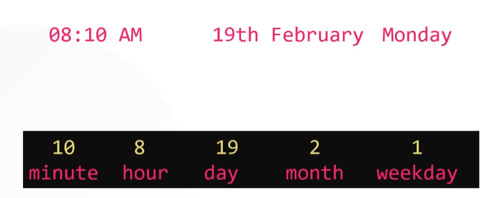

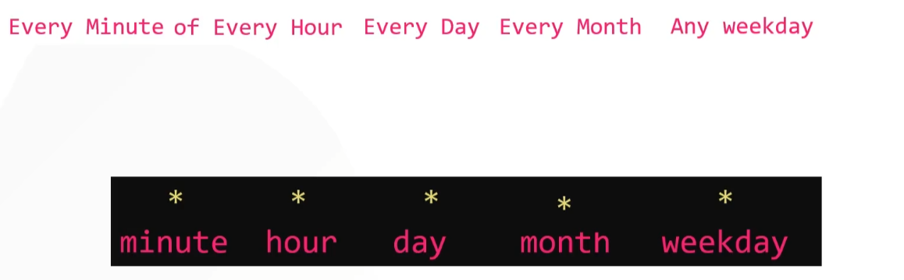

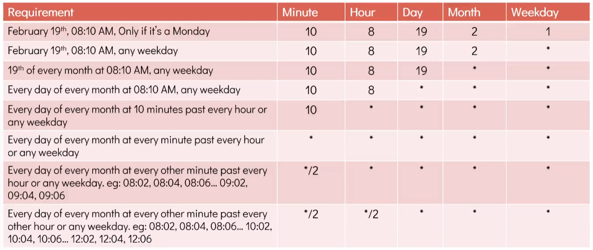

- Cron으로 실행된 명령은 `/var/log/syslog` 에 기록된다.
