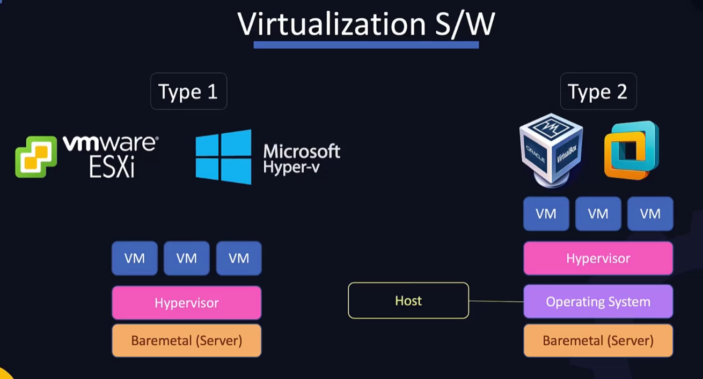
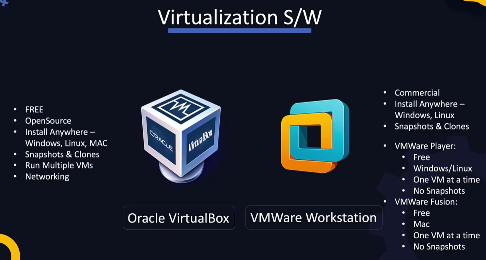
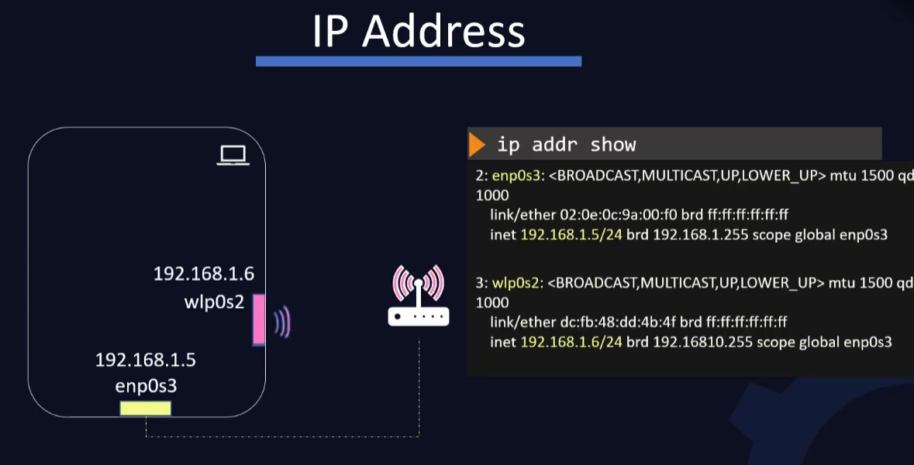
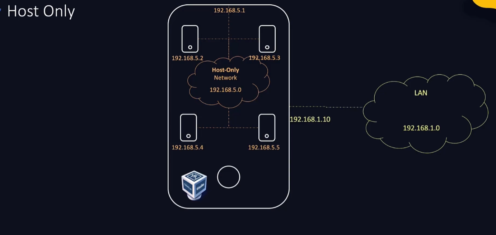
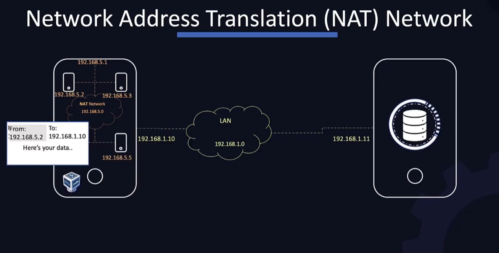
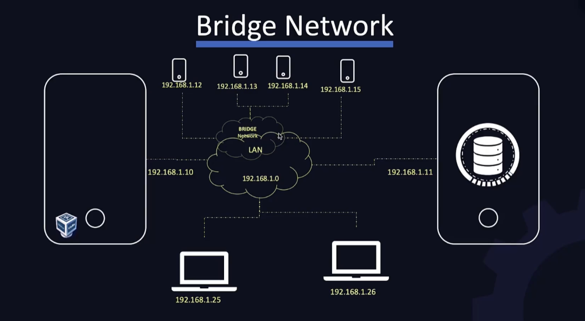
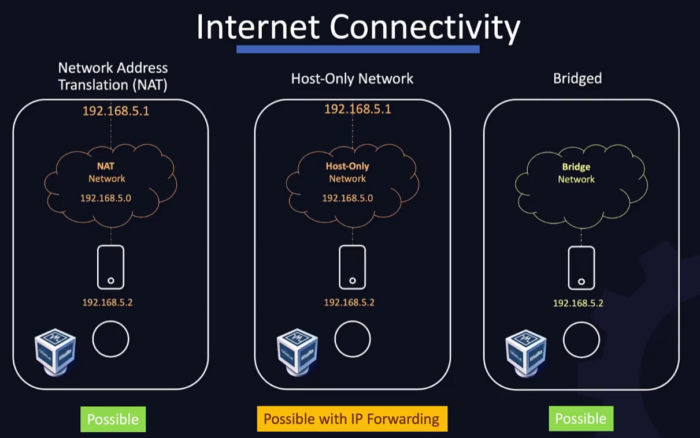
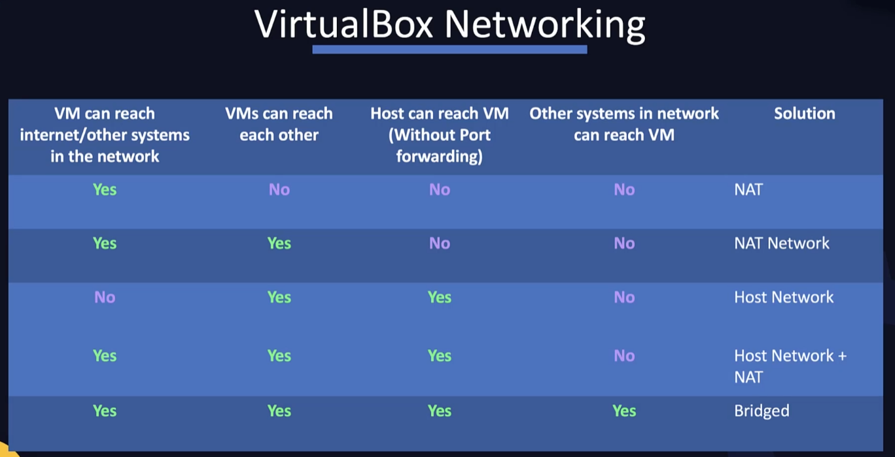
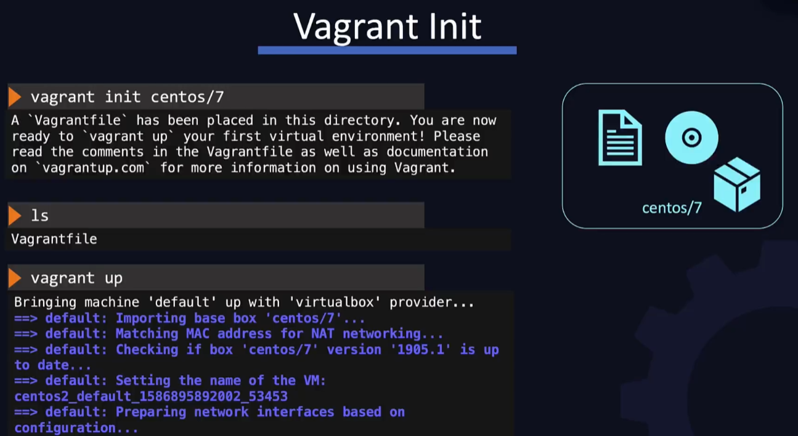
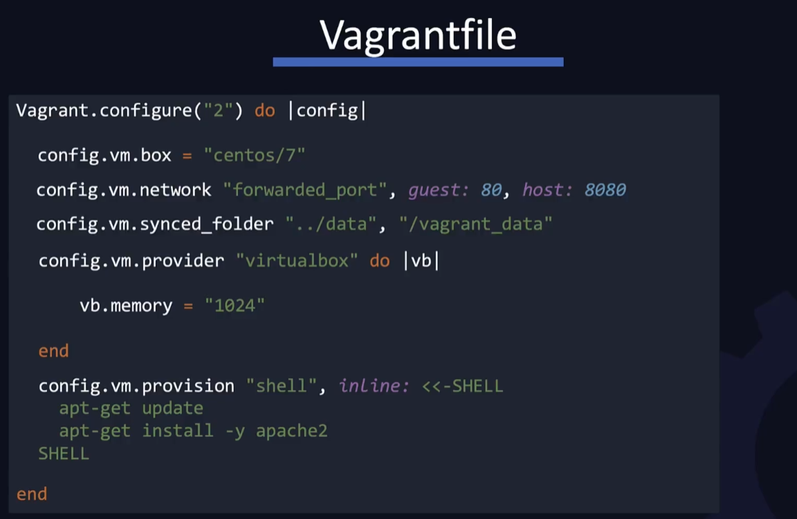

# DevOps Pre-Requisite

## Lab Setup

### VirtualBox

테스트 환경을 구축하기 위해 자신의 컴퓨터 또는 클라우드를 사용할 수 있다.

자신의 컴퓨터를 이용하여 환경을 구축하려면 가상화 기술을 이용하는 것이 좋다.

가상화의 방식에는 크게 두 가지로 나눌 수 있다. 하이퍼바이저가 하드웨어 바로 위에서 실행되는 방식과 호스트 OS 위에서 하이퍼바이저가 실행되는 방식이다.

여기서 우리가 이용할 것은 호스트 OS 위에서 실행되는 방식이다.

해당 방식에서 사용되는 소프트웨어는 크게 두 가지가 있다. 오라클의 VirtualBox와 VMware의 VMWare의 VMWare Workstation이 있다. 각각의 특징은 다음과 같다.

가상의 OS를 만들기 위해선 해당 OS의 이미지 파일이 필요하지만, 각 소프트웨어 별로 이미 설치되어있는 디스크 이미지를 사용하는 것이 가능하기 때문에 해당 디스크 이미지를 [https://www.osboxes.org/](https://www.osboxes.org/) 에서 다운로드 받아서 사용할 수 있다.

### VM Connectivity

- Windows
    - 네트워크 설정을 Bridged Adapter에서 현재 Host PC의 이더넷 컨트롤러를 선택한다.
    - `ip addr show` 명령어로 할당된 Private IP를 확인한다.
- MacOS
    - 네트워크 설정을 NAT로 설정한다.
    - Advanced 탭에서 포트포워딩을 이용한다.

### Virtual Box Networking

네트워크 인터페이스는 각각 하나의 IP 주소를 가진다. 

VirtualBox에는 각 VM당 4개의 Network를 지원하며, 각 인터페이스 마다 다른 네트워크를 사용할 수 있다.

- Host Only
    - Host가 포함된 가상의 사설 네트워크를 만들어 Host에서만 접속할 수 있고 외부와는 통신할 수 없다.
    - 해당 네트워크에 연결된 Device 사이의 통신은 가능하다.
    - 설정 방법은 Host Network Manager에서 가상의 네트워크를 생성한다.
    - VM에서 외부와 통신을 할 경우 IP Forwarding을 통해 가능하다.

    

- Network Address Translation (NAT) Network
    - Host Only 네트워크랑 비슷하지만 외부와의 통신이 가능하다.
    - VM에서 외부로 데이터를 전송할 때 Host의 IP로 변환하여 전송한 후, Request를 받으면 해당 VM의 IP로 다시 변환하여 데이터를 수신한다.
    - 그러나 여전히 외부에서 VM으로의 접속은 불가하다.

    

- Network Address Translation (NAT)
    - NAT Network는 하나의 NAT Router가 여러 개의 VM을 관리하지만, NAT은 각 VM당 하나의 NAT Router를 가진다. 즉 각 VM은 독립적으로 작동하며, VM간의 통신이 불가하다.
- Bridge Network
    - Host IP와 같이 외부에 접근할 수 있는 동일한 대역의 IP를 할당받는다. 따라서 외부에서도 해당 VM에 IP로 접근이 가능하다.

    

인터넷 연결 가능성은 다음과 같다.

VirtualBox에서의 각 Network 설정들을 요약하면 다음과 같다.

### Vagrant

Vagrant는 여러 개의 VM을 효율적으로 관리하기에 유용한 소프트웨어이다. `vagrant up` 명령어 만으로 미리 설정해둔 파일에 맞게 VM들을 세팅해준다.

- `vagrant init [boxs]` : vagrant에서는 이미지를 box라는 단위로 관리한다. init 후에 생성되는 Vagrantfile을 바탕으로 `vagrant up` 명령어가 VM들을 생성하고 관리한다.

    

- Vagrantfile

    Vagrantfile은 `|` 로 구분되는 block이라는 단위를 사용한다.

    

- Vagrant Providers
    - VirtualBox
    - VMWare
    - Hyper-V
    - Docker
    - Custom
