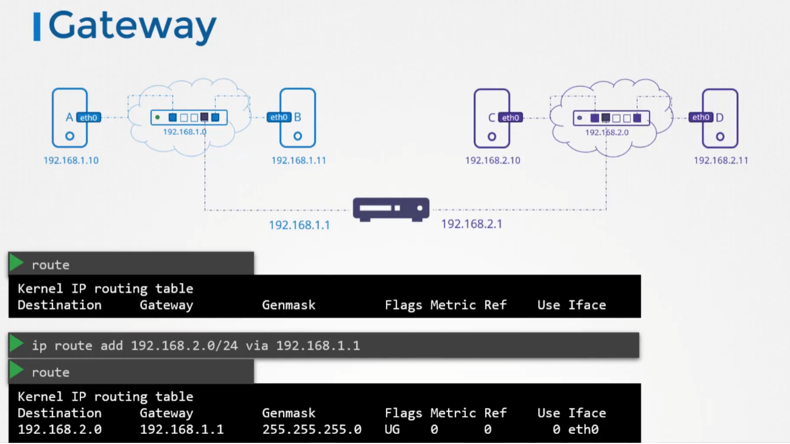
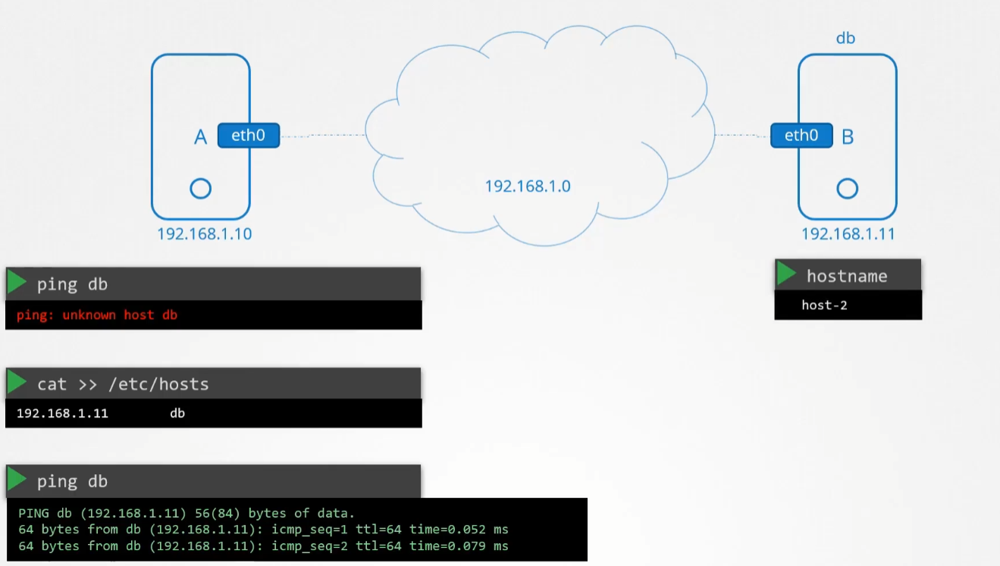
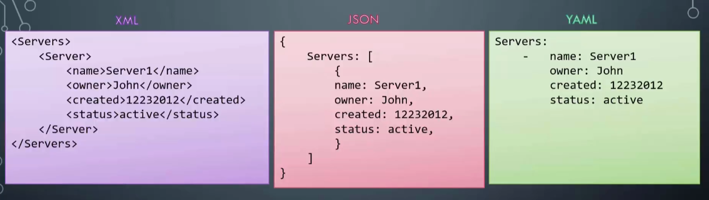
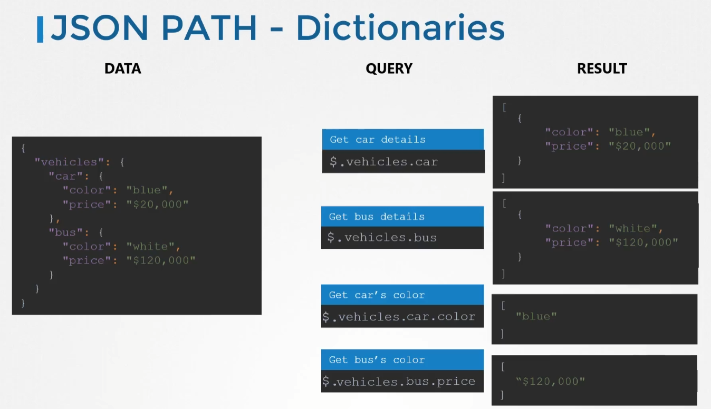
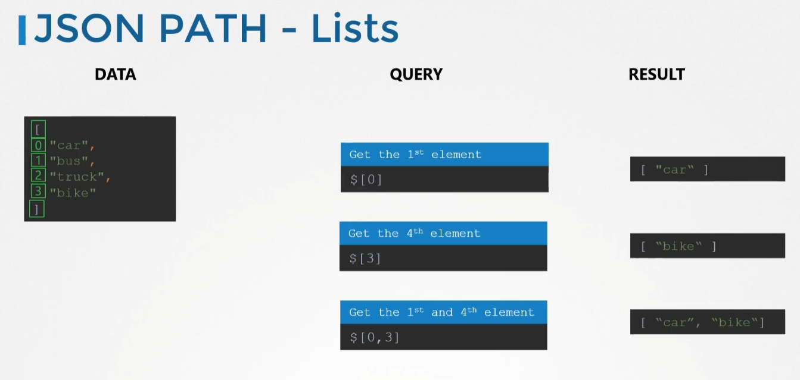
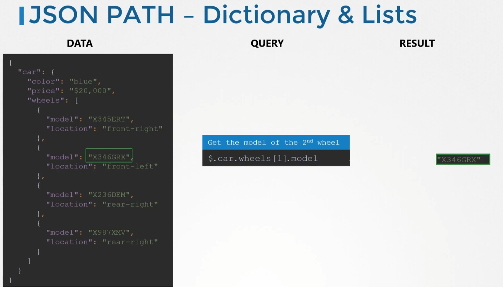
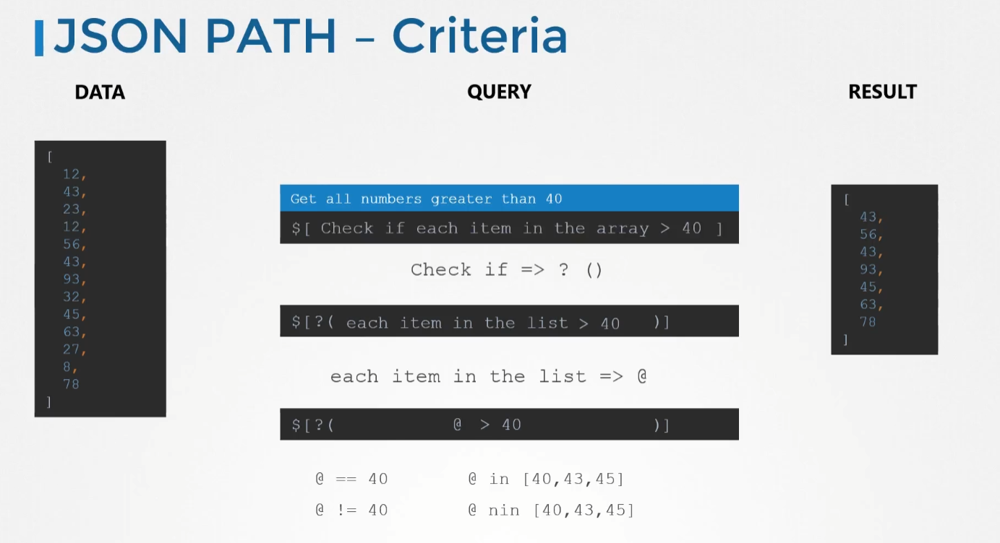
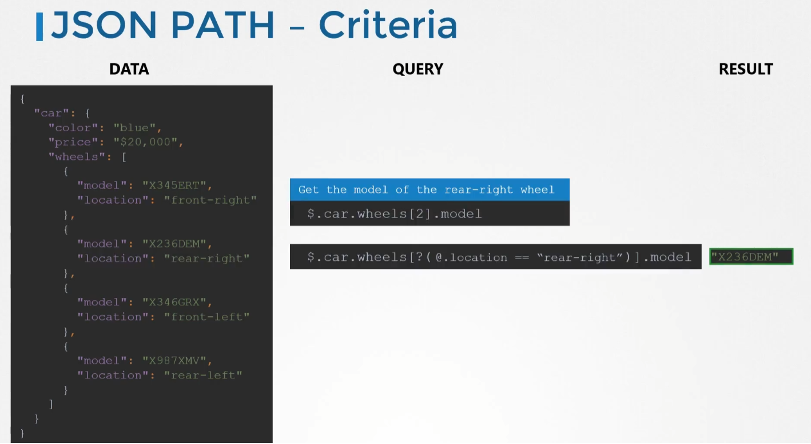

# DevOps Pre-Requisite

## Lab Setup

### VirtualBox

테스트 환경을 구축하기 위해 자신의 컴퓨터 또는 클라우드를 사용할 수 있다.

자신의 컴퓨터를 이용하여 환경을 구축하려면 가상화 기술을 이용하는 것이 좋다.

가상화의 방식에는 크게 두 가지로 나눌 수 있다. 하이퍼바이저가 하드웨어 바로 위에서 실행되는 방식과 호스트 OS 위에서 하이퍼바이저가 실행되는 방식이다.


여기서 우리가 이용할 것은 호스트 OS 위에서 실행되는 방식이다.

해당 방식에서 사용되는 소프트웨어는 크게 두 가지가 있다. 오라클의 VirtualBox와 VMware의 VMWare의 VMWare Workstation이 있다. 각각의 특징은 다음과 같다.


가상의 OS를 만들기 위해선 해당 OS의 이미지 파일이 필요하지만, 각 소프트웨어 별로 이미 설치되어있는 디스크 이미지를 사용하는 것이 가능하기 때문에 해당 디스크 이미지를 [https://www.osboxes.org/](https://www.osboxes.org/) 에서 다운로드 받아서 사용할 수 있다.

### VM Connectivity

- Windows
    - 네트워크 설정을 Bridged Adapter에서 현재 Host PC의 이더넷 컨트롤러를 선택한다.
    - `ip addr show` 명령어로 할당된 Private IP를 확인한다.
- MacOS
    - 네트워크 설정을 NAT로 설정한다.
    - Advanced 탭에서 포트포워딩을 이용한다.

### Virtual Box Networking

네트워크 인터페이스는 각각 하나의 IP 주소를 가진다. 


VirtualBox에는 각 VM당 4개의 Network를 지원하며, 각 인터페이스 마다 다른 네트워크를 사용할 수 있다.

- Host Only
    - Host가 포함된 가상의 사설 네트워크를 만들어 Host에서만 접속할 수 있고 외부와는 통신할 수 없다.
    - 해당 네트워크에 연결된 Device 사이의 통신은 가능하다.
    - 설정 방법은 Host Network Manager에서 가상의 네트워크를 생성한다.
    - VM에서 외부와 통신을 할 경우 IP Forwarding을 통해 가능하다.

    

- Network Address Translation (NAT) Network
    - Host Only 네트워크랑 비슷하지만 외부와의 통신이 가능하다.
    - VM에서 외부로 데이터를 전송할 때 Host의 IP로 변환하여 전송한 후, Request를 받으면 해당 VM의 IP로 다시 변환하여 데이터를 수신한다.
    - 그러나 여전히 외부에서 VM으로의 접속은 불가하다.

    

- Network Address Translation (NAT)
    - NAT Network는 하나의 NAT Router가 여러 개의 VM을 관리하지만, NAT은 각 VM당 하나의 NAT Router를 가진다. 즉 각 VM은 독립적으로 작동하며, VM간의 통신이 불가하다.
- Bridge Network
    - Host IP와 같이 외부에 접근할 수 있는 동일한 대역의 IP를 할당받는다. 따라서 외부에서도 해당 VM에 IP로 접근이 가능하다.

    

인터넷 연결 가능성은 다음과 같다.


VirtualBox에서의 각 Network 설정들을 요약하면 다음과 같다.


### Vagrant

Vagrant는 여러 개의 VM을 효율적으로 관리하기에 유용한 소프트웨어이다. `vagrant up` 명령어 만으로 미리 설정해둔 파일에 맞게 VM들을 세팅해준다.

- `vagrant init [boxs]` : vagrant에서는 이미지를 box라는 단위로 관리한다. init 후에 생성되는 Vagrantfile을 바탕으로 `vagrant up` 명령어가 VM들을 생성하고 관리한다.

    

- Vagrantfile

    Vagrantfile은 `|` 로 구분되는 block이라는 단위를 사용한다.

    

- Vagrant Providers
    - VirtualBox
    - VMWare
    - Hyper-V
    - Docker
    - Custom

## Networking Basics

### Switching and Routing

- Switching
    - 서로 다른 장치를 연결

    

- Routing
    - 네트워크 안에서 데이터를 보낼 때 최적의 경로를 선택하는 과정

    

- Gateway
    - 서로 다른 네트워크를 연결

    

IP Forward을 이용하여 다음과 같은 상황에서도 통신이 이루어질 수 있다. IP Forward 기능을 이용할 경우, 중간에 있는 B 컴퓨터의 `/proc/sys/net/ipv4/ip_forward` 의 값을 1로 바꾸면 된다. 다만, 이 방법은 일시적이기 때문에, 영구적으로 적용할 경우 `/etc/sysctl.conf` 파일의 `net.ipv4.ip_forward = 1`로 변경해주어야 한다.


### DNS

DNS는 Domain Name System의 약자로 IP를 이름으로 사용할 수 있게 해주는 서비스이다.



각 PC마다 `hosts` 파일을 설정해야 한다면, 다른 PC의 IP가 바뀌었을 때 일일이 파일을 수정하기는 쉽지 않은 일이다. 따라서 DNS만을 가지고 있는 서버를 별도로 사용한다. 이를 DNS 서버라고 부른다.


DNS 서버의 주소는 `/etc/resolv.conf` 에 설정한다. 여러 개의 네임서버 주소를 설정할 수 있으며, 도메인을 찾는 순서는 기본적으로 `hosts` → `nameserver` 이다.


## Applications Basics

### Introduction

Language Types

- Compiled : C, C++, Java
    1. Develop Source Code
    2. Compile
    3. Run
- Interpreted : Python, NodeJS, Ruby
    1. Develop Source Code
    2. Run

Code는 사람이 읽을 수 있는 Human Readable Source Code에서 Compiler 를 통해 기계가 읽을 수 있는 Machine Code로 변환된다. 그러나 컴퓨터 마다 CPU등 환경이 다르기 때문에 항상 동일한 Machine Code로 변환해서는 안된다. 따라서 중간에 Byte Code로 변환한 후, 해당 시스템에 맞게 Interpreter가 Machine Code로 변환해준다.

## Web Server

### Apache Web Server

Apache Web Server는 CentOS에서 기본적으로 설치되어 있기 때문에 추가로 설치해줄 필요는 없다. 설치가 되어있지 않을 시, `yum install httpd` 명령어를 이용해서 설치한다.

설치 후에는 `service httpd start` 명령어로 서비스를 시작할 수 있고, `service httpd status` 명령어로 현재 작동 상태를 확인할 수 있다.

방화벽 사용시에는 `firewall-cmd --permanent --add-service=http` 명령어로 방화벽 허용 규칙을 설정해줘야 한다.

log는 `/var/log/httpd/access_log` 또는 `error_log` 파일로 남겨지게 된다.

`/etc/httpd/conf/httpd.conf` 파일을 수정하여 Apache Web Server의 설정을 변경할 수 있다.

 설정 파일을 다음과 같이 설정하면 Apache Web Server 하나로 여러 개의 웹사이트를 호스팅할 수 있다.

```bash
<VirtualHost *:80>
  ServerName www.houses.com
	DocumentRoot /var/www/houses
</VirtualHost>

<VirtualHost *:80>
  ServerName www.oranges.com
	DocumentRoot /var/www/oranges
</VirtualHost>
```

설정 파일을 수정한 후에는 `service httpd restart` 명령어로 재시작해야 설정이 적용된다.

### Apache Tomcat

Apache Tomcat은 자바 기반의 웹 어플리케이션을 호스팅하는 웹서버 환경을 제공한다. 따라서 자바가 먼저 설치되어 있어야 한다.

`bin` 폴더의 스크립트 파일을 이용하여 서버의 실행, 종료를 한다.

### Python - Flask

Flask는 파이썬 기반의 웹 프레임워크이다.

- Gunicorn
- uWSGI
- Gevent
- Twisted Web

### NodeJS- Express

Express.js는 Node.js 기반의 웹 프레임워크이다.

 `npm install` 을 이용하여 Dependency를 설치하고,  `node app.js` 명령어로 실행하거나 `npm run start:dev` 명령어로 실행한다.
 
## Database Basics

### Introduction

DevOps 엔지니어가 데이터베이스를 배워야 하는 이유

- 데이터베이스는 시스템 디자인의 중요한 요소
- Operation 엔지니어들이 데이터베이스를 배포하고 관리
- 앱들은 데이터베이스로부터 읽기, 쓰기 동작

따라서 DevOps 엔지니어는

1. 데이터베이스가 어떻게 배포되는지
2. 데이터베이스가 어떻게 연결되는지
3. 기본적인 트러블슈팅

에 대해서 알고 있어야 한다.

- SQL : Tabular/Relational Database
    - 행과 열로 이루어진 형태에 데이터를 저장한다.
    - 새로운 속성을 추가할 때 해당 속성을 가지지 않는 빈 데이터가 많이 생길 수 있다.
    - 각 행을 Row라고 부르며 Row의 집합을 Table이라고 부른다.
    - 대표적으로 MySQL, PostgreSQL, Microsoft SQL Server 등이 있다.

    

- NoSQL
    - 데이터를 문서나 페이지 형식으로 저장한다.
    - 각 데이터의 모음을 Document라고 부르고 Document의 집합을 Collection이라고 부른다.
    - 대표적으로 MongoDB, DynamoDB, cassandra 등이 있다.

    


두 데이터베이스의 Query 사용법은 다음과 같은 차이가 있다.


### MySQL

MySQL의 특징

- Open source
- Fast
- Reliable
- SQL

Install

```bash
wget https://dev.mysql.com/get/mysql80-community-release-el7-3.noarch.rpm
rpm -ivh mysql80-community-release-el7-3.noarch.rpm
yum install mysql-server
service mysqld start
service mysql status
```

Validate

- Database log : `/var/log/mysqld.log`
- Default port : 3306
- 로그파일에 로그인을 위한 임시 비밀번호가 생성되어 있다.
- `mysql -u root -p[password]` -p flag 뒤에 공백이 없음에 주의
- 패스워드 변경
    - MySQL
        - MySQL Client에서 `ALTER USER 'root'@'localhost' IDENTIFIED BY 'NewPassWord';` 또는 `SET PASSWORD = PASSWORD('P@ssw0rd123');`
        - `FLUSH PRIVILEGES;` : 권한 갱신
    - MariaDB
        - `UPDATE user SET password=PASSWORD('P@ssw0rd123') WHERE User='root' AND Host = 'localhost';`
        - `FLUSH PRIVILEGES`
    - Shell에서 `mysql_secure_installation`
- `SHOW DATABASES;` : 데이터베이스 조회
- `CREATE DATABASE dbname;` : 데이터베이스 생성
- `USE dbname;` : 사용할 데이터베이스 선택
- Table 생성

    ```sql
    CREATE TABLE persons
    (
        Name varchar(255),
    		Age int,
    		Localtion varchar(255)
    );
    ```

- Table에 데이터 입력

    ```sql
    INSERT INTO persons values
    ( "John doe", 45, "New York");
    ```

- `SELECT * FROM persons;` : 데이터 조회

Create User

- `CREATE USER 'hyulee'@'localhost' IDENTIFIED BY 'PassWord!';` : 유저 생성
    - `'username'@'host'` 에서 해당하는 host에서만 접속이 가능하다. 따라서 localhost로 계정 생성 시, localhost에서만 접속이 가능하게 된다.
    - `'username'@'%'` : host 부분에 `%` 기호를 사용하면 모든 시스템에서 접근 가능하다.

Privileges

- `GRANT <PERMISSION> ON <DB.TABLE> TO 'hyulee'@'%';` : 해당 유저에게 권한 부여
    - ALL PRIVILEGES : 모든 권한 부여
    - CREATE : 데이터베이스 생성 권한
    - DROP : 데이터베이스 제거 권한
    - DELETE : 테이블의 행 제거 권한
    - INSERT : 테이블의 행 추가 권한
    - SELECT : 테이블 읽기/쿼리 권한
    - UPDATE : 테이블의 행 갱신 권한
- `GRANT SELECT, UPDATE ON school.persons TO 'hyulee'@'%';` : 여러 개의 권한 부여 가능
- `GRANT SELECT, UPDATE ON school.persons TO 'hyulee'@'%';` : 여러 개의 권한 부여 가능
- `GRANT SELECT, UPDATE ON school.* TO 'hyulee'@'%';` : 특정 DB의 모든 테이블에 권한 부여
- `GRANT ALL PRIVILEGES ON *.* TO 'hyulee'@'%';` : 모든 데이터베이스와 테이블에 모든 권한 부여
- `SHOW GRANTS FOR 'hyulee'@'localhost';` : 특정 유저에게 부여된 권한 확인

### MongoDB

MongoDB의 특징

- Open soruce
- NoSQL
- Scalable
- High Performance

Install

- Cloud
    - Cloud에서 사용할 수 있는 MongoDB Atlas는 미리 설정이 되어있어 쉽게 사용할 수 있다.
- Server
    - `yum install mongodb-org`

Start DB Service

- `systemctl start mongod`
- `systemctl status mongod`

Validate

- Logs : `/var/log/mongodb/mongod.log`
- Default port : 27017. 초기 설정에서는 127.0.0.1을 Listening 하고 있기 때문에 외부 접속이 불가하다.
- Configuration File : `/etc/mongod.confg`
    - port, IP address 등 여러 가지 설정을 변경할 수 있다.

Mongo Shell

- `mongo` : 데이터베이스 접속
- 초기에는 기본적으로 모든 접근이 제한되어 있기 때문에 따로 권한을 설정해주어야 한다.
- `show dbs` : 데이터베이스 조회
- `use school` : 데이터베이스 생성 및 사용
- `db` : 현재 사용 중인 데이터베이스 조회
- `db.createCollection("persons")` : Collection 생성
- `show collections` : Collection 조회
- Document 생성 : JSON 포맷 사용

    ```python
    db.persons.insert({
    	"name": "hyulee",
    	"age": 29,
    	"location": "Seoul",
    	"salary": 5000
    })
    ```

- `db.persons.find()` : Collection 조회
    - `db.persons.find({"name": "hyulee"})` : find 함수의 arguments로 JSON 포맷을 사용하여 특정 데이터를 조회할 수 있다.

## Security

### SSL & TLS Basics

SSL은 서버와 데이터를 주고받을 때, 데이터의 보안을 위해 사용한다. 만약 SSL 없이 통신하게 될 경우 중요한 데이터가 해커에 의해 도청당하여 악용될 가능성이 있다.

암호화를 하는 방식은 크게 두 가지로 나눌 수 있다.

- 대칭 키 암호화(Symmetric key algorithm)
    - 암호화(Encryption)와 복호화(Decryption)에 같은 키를 사용한다.
    - 비대칭 키 방식에 비해 빠르다.
    - 키를 해킹 당할 경우, 암호화의 의미가 없어진다.
- 비대칭 키 암호화(Asymmetric key algorithm)
    - 암호화(Encryption)와 복호화(Decryption)에 다른 키를 사용한다.
    - 통상적으로 공개 키(Public key)와 비밀 키(Private key)로 구분한다.
    - 대칭 키 방식에 비해 느리다.
    - 공개 키로 암호화한 데이터는 같은 쌍의 비밀 키를 이용하여 복호화 할 수 있다. 따라서 암호화가 필요한 데이터를 공개 키를 이용하여 암호화를 하고 해당 데이터를 전송하여 비밀 키로 복호화 한다.

일반적으로 대칭 키 암호화 알고리즘이 비대칭 키 암호화 알고리즘보다 빠르기 때문에 비대칭 키 방식을 이용하여 대칭 키를 교환하고, 이후로는 대칭 키를 이용하는 방식으로 데이터를 주고받는다.

- `ssh-keygen` : key file 생성
- `ssh-copy-id` : key file 복사

위와 같은 방식으로 키를 교환하여 데이터를 주고 받으면 안전하다고 생각할 수 있을 것이다. 그러나 해커에 의해 내가 접속하고자 하는 사이트(ex. 은행 사이트)가 아닌 피싱 사이트로 접속하게 된다면 암호화를 한다고 해도 내 데이터는 안전하지 않을 것이다. 따라서 해당 웹사이트가 정상적인 웹사이트인지 확인하기 위해 **인증서(Certification)**가 존재한다.

이러한 인증서를 발급해주는 기관을 CA(Certificate Authority)라고 하며, Symantec, DigiCert, Comodo, GlobalSign과 같은 회사들이 있다.

- 인증서 발급 방법

    `openssl` 을 이용하여 인증서를 발급 받을 수 있다.

    ```bash
    openssl req -new -key my-bank.key -out my-bank.csr 
    openssl x509 -req -days 365 -in my-bank.csr -signkey my-bank.key -out my-bank.crt
    ```

- 인증서가 발급되는 과정
    1. Certificate Signing Request(CSR)을 생성한다.
    2. 개인 키를 이용하여 정보를 검증한다.
    3. 서명 후 인증서를 생성한다.

    만약 해커가 피싱을 위해 특정 사이트의 인증서를 발급받을 경우, 이미 인증되어 있는 사이트라면 해당 인증서를 발급받을 때 사용했던 개인 키 파일이 있어야 하므로 2번의 검증 단계에 실패하여 해당 사이트의 인증서를 발급받을 수 없게 된다. 따라서 해커는 해당 사이트의 도메인을 인증 받은 도메인으로 호스팅할 수 없게 된다.

우리가 사용하는 브라우저에는 이미 신뢰할 수 있는 인증서들이 저장되어 있다. 따라서 우리가 여러 웹사이트를 접속할 때 브라우저에서 자동적으로 해당 사이트가 안전한지 아닌지 검증해준다.

- PKI(Public Key Infrastructure)

    메세지의 암호화 및 전자서명을 제공하는 복합적인 보안 시스템을 말한다. 간단하게 이야기하면 신분을 증명하는 시스템이라고 할 수 있다. 해당 시스템을 요약하자면 다음과 같다.

    1. 비대칭 키를 이용하여 SSH로 원격 접속
    2. 서버의 개인 키를 이용하여 서버의 공개 키 정보를 포함하는 CSR 생성
    3. 생성된 CSR을 CA의 개인 키로 암호화하여 인증서 발급
    4. 사용자가 서버에 접속하면 해당 인증서를 전송하고, 브라우저는 해당 인증서를 CA의 공개 키를 이용하여 복호화
    5. 복호화한 인증서엔 서버의 공개 키를 포함하고 있으므로, 해당 키를 이용하여 클라이언트의 대칭 키를 암호화하여 서버로 전송
    6. 서버의 개인 키를 이용하여 클라이언트의 대칭 키를 포함하고 있는 데이터를 복호화
    7. 대칭 키를 이용하여 클라이언트와 서버가 통신

    만약 키에만 의존하여 통신을 하면 해커가 대칭 키를 획득하여 서버와 통신을 시도할 때, 서버는 데이터가 어디서 왔는지 신경쓰지 않고 요청에 대해 응답할 것이다. 따라서 데이터를 요청하는 사용자가 누구인지 확인하기 위해 클라이언트 인증서를 사용한다. 클라이언트 인증서는 사용 중인 시스템을 기반으로 자동적으로 생성하여 서버로 전송하기 때문에 별도의 조작이 필요하지 않다.

    인증서나 공개 키는 주로 `*.crt`, `*.pem` 파일명을 사용하고, 개인 키는 `*.key`, `*-key.pem` 을 사용한다.

## General Pre-Requisites



### YAML

YAML은 데이터를 표현하는 하나의 Format이다.

YAML 파일로 데이터를 나타내는 방법에는 크게 3가지가 있다.

- Key Value Pair

    ```yaml
    Fruit: Apple
    Vegetable: carrot
    Liquid: Water
    Meat: Chicken
    ```

- Array/List - Ordered

    ```yaml
    Fruits:
    -  Orange
    -  Apple
    -  Banana

    Vegetables:
    -  Carrot
    -  Cauliflower
    -  Tomato
    ```

- Dictionary/Map - Unordered

    ```yaml
    Banana:
      Calories: 105
    	Fat: 0.4 g
    	Carbs: 27 g

    Grapes:
    	Calories: 62
    	Fat: 0.3 g
    	Carbs: 16 g
    ```

YAML 파일은 Space로 속성을 구분하므로 Indent에 주의한다.

- Key Value/Dictionary/Lists

    ```yaml
    Fruits:
    	-	Banana:
    		  Calories: 105
    			Fat: 0.4 g
    			Carbs: 27 g
    		
    	-	Grapes:
    			Calories: 62
    			Fat: 0.3 g
    			Carbs: 16 g
    ```

- Dictionary vs List vs List of Dictionaries
    - Dictionary in Dictionary

        

    - List of Strings

        

    - List of Dictionaries

        

- Dictionary/Map vs Array/List

    Dictionary는 순서가 없지만 List는 순서가 있다.

    

### JSON & JSON Path

- JSON

    JSON은 중괄호(`{}`)를 사용하여 데이터를 구분한다.

    List는 대괄호(`[]`)를 사용하여 정의하며, List의 각 요소는 comma(`,`)로 구분한다.

    JSON과 YAML은 서로 쉽게 변환할 수 있다.

- JSON Path

    JSON Path는 JSON 또는 YAML 포맷으로 되어있는 데이터를 분석해주는 Query Language이다.

    dot(`.`)을 이용하여 해당 필드의 특정 요소에 접근할 수 있다.

    - Dictionaries

        root Dictionary가 존재하며, 해당 Dictionary에 접근할 땐 `$` 표시를 사용한다.

        쿼리를 실행했을 때 얻어지는 결과값은 List형태로 출력된다.

        

    - List

        root List가 존재하며, 해당 List에 접근할 땐 `$` 표시를 사용한다.

        List의 Index로 요소에 접근한다.

        

    - Dictionary & Lists

        

    - Criteria

        조건문을 이용하여 특정 결과만 얻어낼 수 있다.

        

        `car.wheels.location == "rear-right"` 인 `model`을 찾는 쿼리 예제

        

- Query

    
