# Shell Scripts for Beginners

## Course Introduction

Shell Script를 이용한 자동화는 시간을 절약해주고 생산성을 향상시켜주기 때문에 시스템 관리자라면 반드시 알아야 하는 스킬이다. Shell Script를 이용하면 다음과 같은 업무에 도움이 될 수 있다.

- Automate Daily Backups
- Automate Installation and Patching of software on multiple servers
- Monitor system periodically
- Raise alarms and send notifications
- Troubleshooting and Audits
- Many More

이 강의에서는 Shell Script를 이용해서 우주로 로켓을 쏠 것이다(?). 로켓을 발사하는 과정은 다음과 같다.

1. Start Auxiliary Power
2. Switch to Internal Power
3. Auto Sequence Start
4. Main Engine Start
5. Lift Off

위 과정은 각각 command를 통해 이루어지기 때문에 각 프로세스에 해당하는 것들을 Shell Script로 만들어볼 예정이다.

## Shell Script Introduction

### Create your first shell script

로켓을 발사하기 위한 command를 하나씩 입력했던 것을 Shell Script로 작성하면 다음과 같다.

```bash
# create-and-launch-rocket.sh
mkdir lunar-mission

rocket-add lunar-mission

rocket-start-power lunar-mission
rocket-internal-power lunar-mission
rocket-start-sequence lunar-mission
rocket-start-engine lunar-mission
rocket-lift-off lunar-mission

rocket-status lunar-mission
```

위의 스크립트를 실행시키면 각 command가 한 줄씩 작동하게 된다.

생성한 sh파일을 실행시키기 위해 `create-and-launch-rocket` 을 command로 입력하면 command를 찾을 수 없다는 에러가 발생한다. command는 환경변수 `PATH` 의 경로에 있는 command만 인식할 수 있기 때문에 경로를 추가하거나 해당 폴더로 옮겨서 command를 실행할 수 있다.

command를 실행하기 위해서는 실행 권한을 가지고 있어야 한다. 따라서 실행 권한이 없을 경우에는 `chmod` 명령어로 실행 권한을 부여한다.

### Variables

- Shell Script에서 변수는 `$` 로 시작한다.

    ```bash
    # create-and-launch-rocket.sh
    mission_name=lunar-mission

    mkdir $mission_name

    rocket-add $mission_name

    rocket-start-power $mission_name
    rocket-internal-power $mission_name
    rocket-crew-ready $mission_name
    rocket-start-sequence $mission_name
    rocket-start-engine $mission_name
    rocket-lift-off $mission_name

    rocket_status=$(rocker-status $mission_name)
    echo "Status of launch: $rocket_status"
    ```

- 변수 이름은 항상 **Alphanumeric** 또는 **_** 로 이루어져야 하며, 대소문자를 구분한다. 대문자는 환경변수를 나타낸다.
- 명령어의 실행 결과는 `$(command)` 로 변수로 사용할 수 있다.
- 변수를 확실하게 나타내고자 할 때는 `${variable_name}` 를 사용한다.


### Command Line Arguments

하드코딩하여 Script를 실행할 때 마다 variable을 수정하는 것은 매우 비효율적인 일이다. 따라서 variable을 arugment로 사용할 수 있다.

- Augment는 0부터 시작한다. 0은 command이다.
- Shell Script에서는 `$` 뒤의 숫자를 붙이면 Argument로 인식한다.


- Argument를 Variable에 할당하지 않고 사용할 수도 있다. 그러나 이런 코드는 가독성을 떨어뜨리기 때문에 지양한다.


### Read Inputs

- `read` 명령어를 이용해서 stdin으로 받은 값을 Variable로 사용할 수 있다. `read` 명령어만 사용할 경우 입력 prompt만 보여지기 때문에 구체적으로 어떤 값에 대한 입력인지 알기 어렵기 때문에 `-p` 옵션을 이용하여 해당 Input에 대한 설명을 입력할 수 있다.
    - `read -p "Enter mission name:" mission_name`


### Arithmetic Operations

- `expr` : 사칙연산을 한다. 각 연산은 space로 구분되어야 한다.
    - `expr 6 + 3` → 9
    - `expr 6 - 3` → 3
    - `expr 6 / 3` → 2
    - `expr 6 \* 3` → 18 : 곱하기의 경우 `*`는 wildcard로 사용되기 때문에 escape 문자를 붙여서 사용한다.
- double parentheses : `(())`를 이용한 연산을 한다. `expr`과 달리 변수 앞에 `$`를 붙이거나 곱하기에 escape 문자를 사용하지 않아도 된다. 또한 증감연산자를 지원한다. return 값은 항상 정수이다.
    - `echo $(( A + B ))`
    - `echo $(( A-B ))`
    - `echo $(((A/B))`
    - `echo $(( A * B ))`
    - `echo $(( ++A ))`
    - `echo $(( --A ))`
    - `echo $(( A++ ))`
    - `echo $(( A-- ))`
- `bc` : basic calculator. 연산의 입력을 pipe로 받아야 한다.
    - `echo $A / $B | bc -l`
        - `-l` : floating point result

    

## Flow Control

### Conditional Logic

만약 로켓이 발사했을 때 실패했다면, 실패의 원인을 알고 싶을 것이다. 따라서 로켓 발사가 실패했을 때만 `rocket-debug` 커맨드가 실행되도록 할 것이다.

- if, else if, else

```bash
# if rocket-status is failed, then run this
if [ $rocket_status = "failed" ]
then
		rocket-debug $mission_name
elif [ $rocket_status = "success" ]
then
		echo "This is successful"
else
		echo "The state is not failed or success"
fi
```

- Conditional Operators
    - 두 값을 비교할 때에는 대괄호를 사용하며 각 값 사이에 공백이 있어야 한다.

        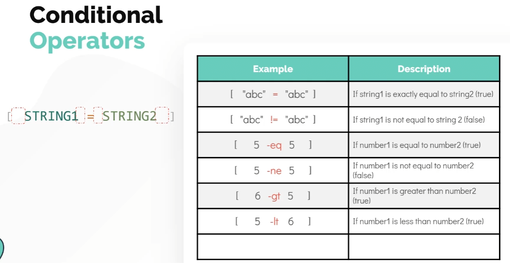

    - bash에서는 `[[ ]]` 를 이용한 표현식이 가능하다.

        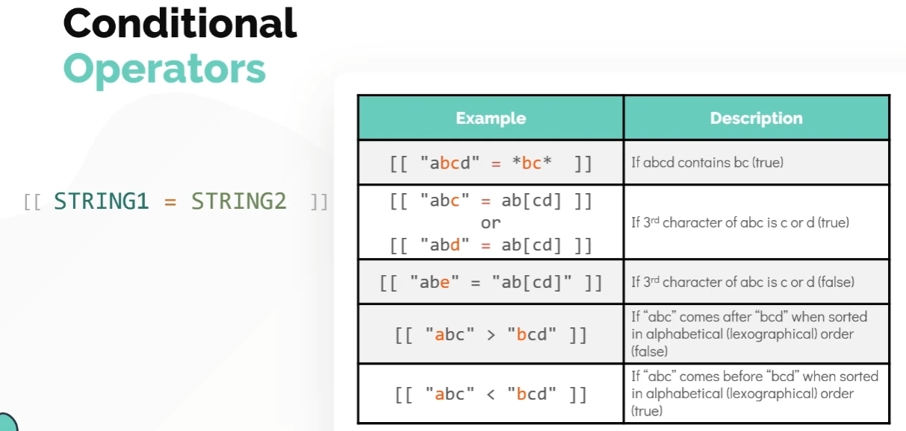

    - `[ COND1 ] && [ COND2 ]` or `[[ COND1 && COND2 ]]` : and 연산
    - `[ COND1 ] || [ COND2 ]` or `[[ COND1 || COND2 ]]` : or 연산

    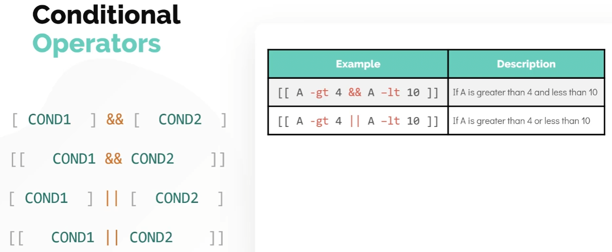

    - File Level Operations

        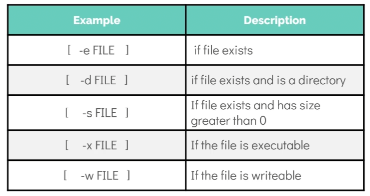
	
### Loops - For

동일한 기능을 하는 command를 여러 번 실행시킨다고 할 때, 하드코딩으로 일일이 코드를 작성하는 것은 비효율적이다. 따라서 `for` 를 이용하여 반복되는 작업을 줄일 수 있다.

```bash
for mission in lunar-mission jupiter-mission saturn-mission
do
	create-and-launch-rocket $mission
done
```

만약 미션 이름들이 특정 파일에 있다고 하면 다음과 같이 쓸 수 있다.

```bash
for mission in 'cat mission-names.txt'
do
	create-and-launch-rocket $mission
done
```

또는 `$` 를 이용하여 다음과 같이 쓸 수 있다.

```bash
for mission in $(cat mission-names.txt)
do
	create-and-launch-rocket $mission
done
```

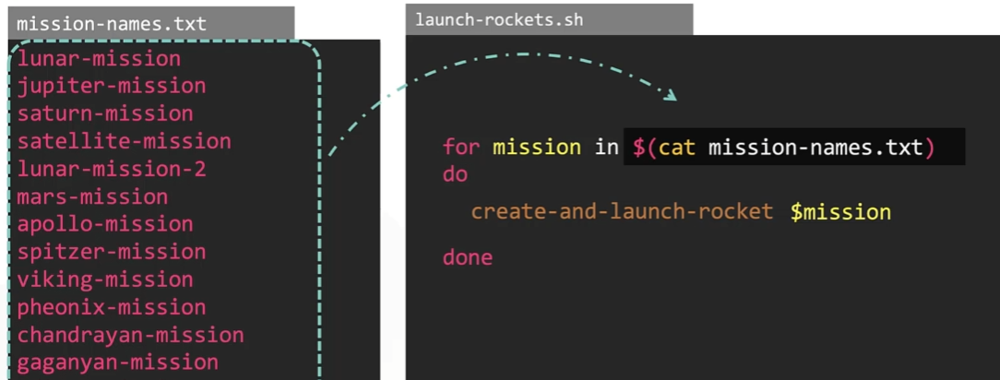

Index를 이용한 표현 방법에는 여러 가지 방법이 있다.

- List

    ```bash
    for mission in 1 2 3 4 5 6
    do
    	create-and-launch-rocket mission-$mission
    done
    ```

- Brackets : `{start_point..end_point}`

    ```bash
    for mission in {0..100}
    do
    	create-and-launch-rocket mission-$mission
    done
    ```

- C Style

    ```bash
    for (( mission = 0; mission < = 100; mission++ ))
    do
    	create-and-launch-rocket mission-$mission
    done
    ```

For Loop를 사용해야 하는 때

- Execute a command or a set of commands many times
- Iterate through files
- Iterate through lines within a file
- Iterate through the output of a command

실제 사용 예시

- 현재 디렉토리의 각 파일의 줄 수

    ```bash
    for file in $(ls)
    do
    	echo Line count of $file is $(cat $file | wc -l)
    done
    ```

- 여러 개의 패키지 단일 설치

    ```bash
    for package in $(cat install-packages.txt)
    do
    	sudo apt-get -y install $package
    done
    ```

- 서버 별 uptime 확인

    ```bash
    for server in $(cat servers.txt)
    do
    	ssh $server "uptime"
    done
    ```

- 파일 확장자 변경하기

    ```bash
    for file in $(ls)
    do
    	if [[ $file = *.jpeg ]]
    	then
    		new_name=$(echo $file | sed 's/jpeg/jpg/g')
    		mv $file $new_name
    	fi
    done
    ```

### Loops - While

`while`은 특정 조건을 만족할 때 까지 `for`를 반복하는 문법이다.

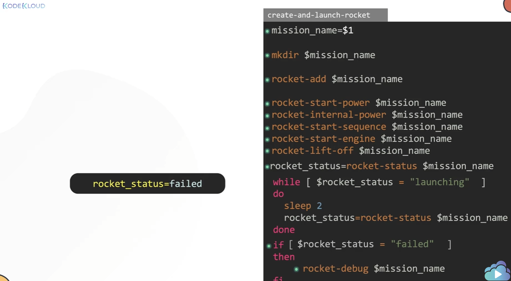

While을 사용해야 하는 때

- Execute a command or a set of commands multiple times but you are not sure how many times.
- Execute a command or a set of commands until a specific condition occurs
- Create infinite loops
- Menu driven programs

실제 사용 예시

- Menu driven programs

    ```bash
    while true
    do
    	echo "1. Shutdown"
    	echo "2. Restart"
    	echo "3. Exit Menu"
    	read -p "Enter your choice: " choice
    	
    	if [ $choice -eq 1 ]
    	then
    		shutdown now
    	elif [ $choice -eq 2 ]
    	then
    		shutdown -r now
    	elif [ $choice -eq 3 ]
    	then
    		break
    	else
    		continue
    	fi
    done

    ```

- Calculator

    ```bash
    while true
    do
      echo "1. Add"
      echo "2. Subtract"
      echo "3. Multiply"
      echo "4. Divide"
      echo "5. Quit"

      read -p "Enter your choice: " choice

      if [ $choice -eq 1 ]
      then
            read -p "Enter Number1: " number1
            read -p "Enter Number2: " number2
            echo Answer=$(( $number1 + $number2 ))
      elif [ $choice -eq 2 ]
      then
            read -p "Enter Number1: " number1
            read -p "Enter Number2: " number2
            echo Answer=$(( $number1 - $number2 ))
      elif [ $choice -eq 3 ]
      then
            read -p "Enter Number1: " number1
            read -p "Enter Number2: " number2
            echo Answer=$(( $number1 * $number2 ))
      elif [ $choice -eq 4 ]
      then
            read -p "Enter Number1: " number1
            read -p "Enter Number2: " number2
            echo Answer=$(( $number1 / $number2 ))
      elif [ $choice -eq 5 ]
      then
        break
      fi

    done
    ```

### Case Statements

Case는 여러 개의 `if` 를 조금 더 가독성 좋은 코드로 만든 것이라고 볼 수 있다.

Case는 `case` 로 시작하여 `esac` 로 끝난다.

```bash
while true
do
	echo "1. Shutdown"
	echo "2. Restart"
	echo "3. Exit Menu"
	read -p "Enter your choice: " choice
	
	case $choice in
		
		1) shutcown now
			;;
		2) shutdown -r now
			;;
		3) break
			;;
		*) continue
			;;

	esac
done

```

## Shebang

### Shebang

Shebang은 인터프리터 지시어이다. 즉, 스크립트를 읽는 인터프리터를 지정한다.

sh와 bash는 각각 기능이 다르기 때문에 bash의 문법이 sh에는 없거나 한 경우, bash로 실행시켜야 할 스크립트를 sh로 실행시키게 된다면 정상적으로 작동하지 않을 것이다. 따라서 이런 경우에 특정 인터프리터를 이용하여 실행할 수 있도록 사용하는 것이 Shebang이다.

```bash
#!/bin/bash

echo {1..10}
```

### Exit Codes

command를 실행했을 때, 정상적으로 종료했을 경우와 정상적으로 종료되지 않았을 경우가 있을 수 있다. 따라서 각 경우에 따라 다른 Exit Code를 반환한다. 해당 코드는 command를 실행한 후 `$?` 에 저장되며 `echo $?` 를 통해 확인할 수 있다. 일반적으로 정상 종료는 0을 반환한다.

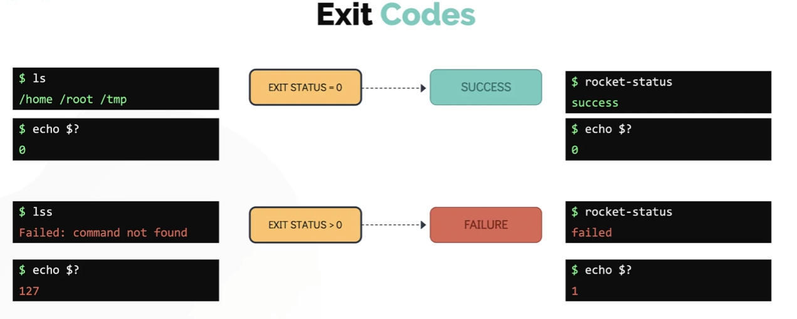

Exit code를 직접 지정해주고 싶을 땐, 에러가 발생하는 곳에서 `exit` 함수의 Argument를 지정한다.

```bash
# create-and-launch-rocket.sh
mission_name=$1

mkdir $mission_name

rocket-add $mission_name

rocket-start-power $mission_name
rocket-internal-power $mission_name
rocket-crew-ready $mission_name
rocket-start-sequence $mission_name
rocket-start-engine $mission_name
rocket-lift-off $mission_name

rocket_status=$(rocker-status $mission_name)

while [ $rocket_status == "launching" ]
do
  sleep 2
  rocket_status=rocket-status $mission_name
done
if [ $rocket_status = "failed" ]
then
	rocket-debug $mission_name
	exit 1
fi
```

함수가 비정상적으로 종료될 땐, 적절한 Exit code를 반환해주도록 한다.

### Functions

Shell Script에서도 다른 언어와 마찬가지로 함수를 지원한다. 따라서 같은 기능 여러 번 사용할 땐 함수로 만들어서 사용하는 것이 좋다.

```bash
# create-and-launch-rocket.sh
function launch-rocket() {
	mission_name=$1
	
	mkdir $mission_name
	
	rocket-add $mission_name
	
	rocket-start-power $mission_name
	rocket-internal-power $mission_name
	rocket-crew-ready $mission_name
	rocket-start-sequence $mission_name
	rocket-start-engine $mission_name
	rocket-lift-off $mission_name
	
	rocket_status=$(rocker-status $mission_name)
	
	while [ $rocket_status == "launching" ]
	do
	  sleep 2
	  rocket_status=rocket-status $mission_name
	done
	if [ $rocket_status = "failed" ]
	then
		rocket-debug $mission_name
		exit 1
	fi
}

launch-rocket lunar-mission
```

아래 그림과 같이 함수 뒤에 오는 Arguments는  함수의 Parameter로 사용된다.

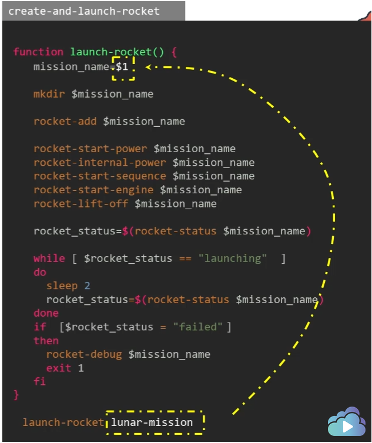

Shell Script는 위에서부터 아래로 읽어나가기 때문에 반드시 함수를 사용하기 전에는 먼저 정의가 되어있어야 한다. 함수를 정의하지 않고 사용할 경우에는 에러가 발생한다.

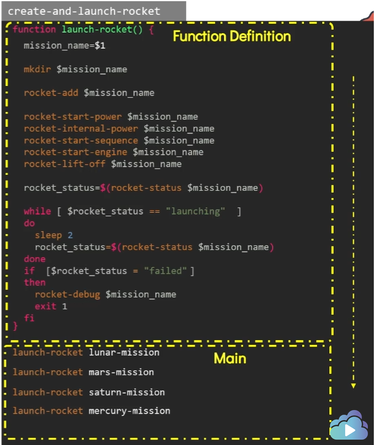

또한 함수에서 에러가 발생하여 exit을 한다면 함수가 종료될 것이다. 따라서 exit 대신 return을 이용하여 함수의 exit code를 반환할 수 있다. 해당 코드는 여전히 `$?` 를 통해 알 수 있다.

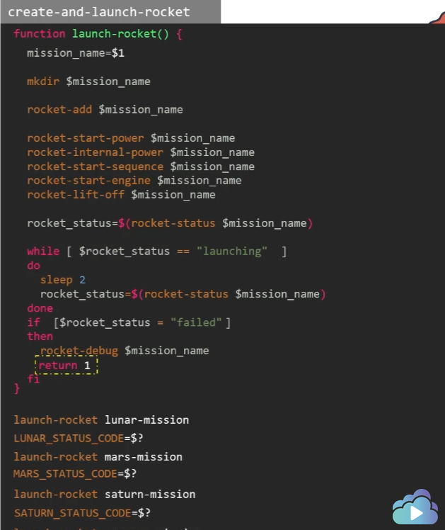

함수를 사용해야 하는 때

- Break up large script that performs many different tasks:
    - Installing packages
    - Adding users
    - Configuring firewalls
    - Perform Mathematical calculations

만약 함수의 값을 변수로 사용하고 싶을 땐 다음과 같다.

```bash
function add(){
	echo $(( $1 + $2 ))
}

sum=$( add 3 5 )
```

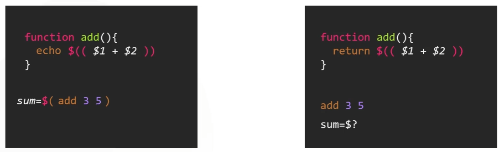

그러나 return을 사용해서는 안된다. return은 Exit code만 사용 가능하며, Exit code는 0에서 255범위만을 가지기 때문에 text나 더 큰 값을 표현할 수 없다.

### Tips & Tricks - ShellCheck & IDE

Shell Script도 vim에서는 Syntax highlighting을 지원하며, shellcheck같은 툴을 이용하여 문법을 검사할 수 있다.

- ShellCheck
    - `yum install shellcheck` or `apt-get install shellcheck`
    - `shellcheck shell_script.sh`
- PyCharm
- Visual Studio Code
