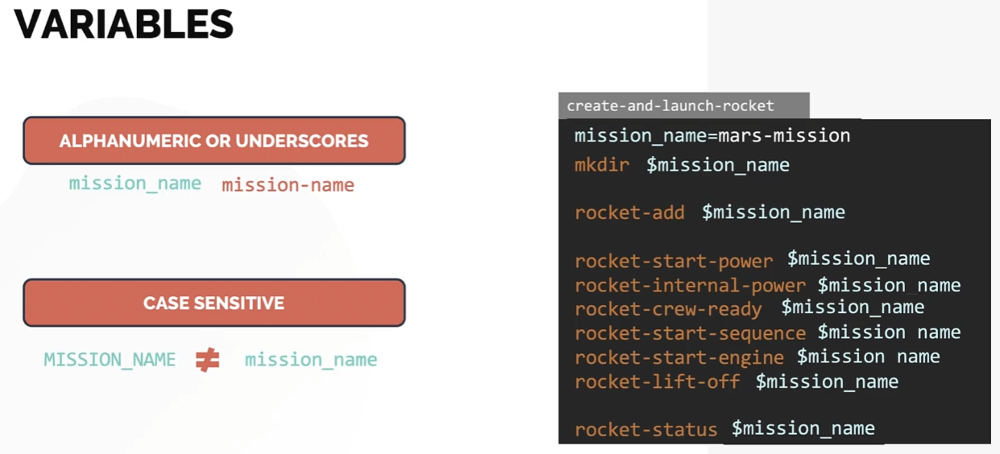
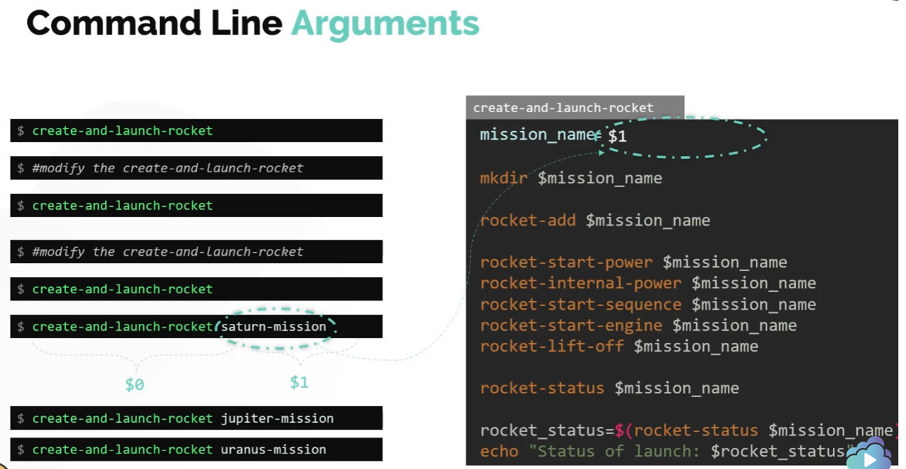
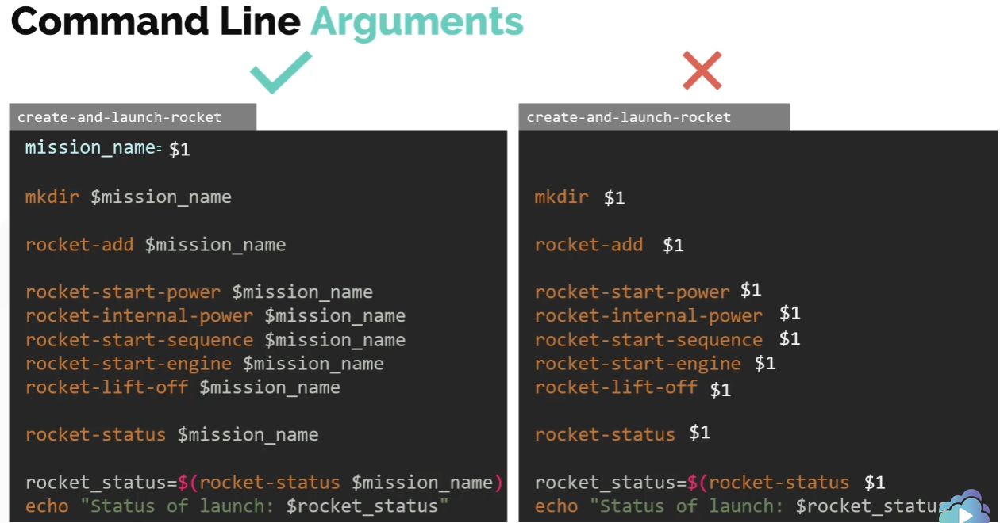
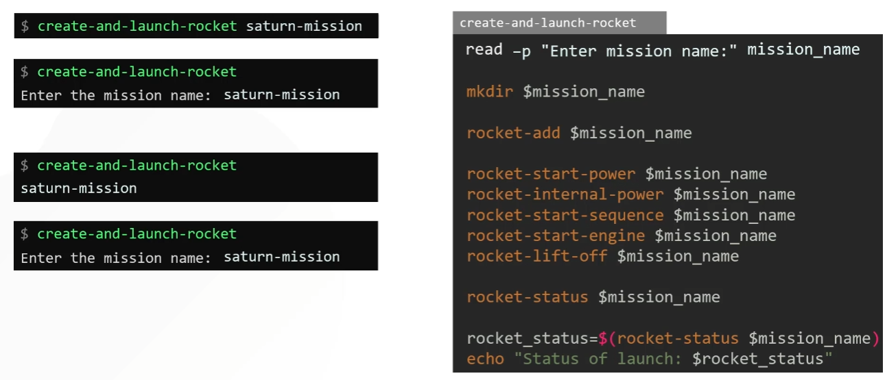
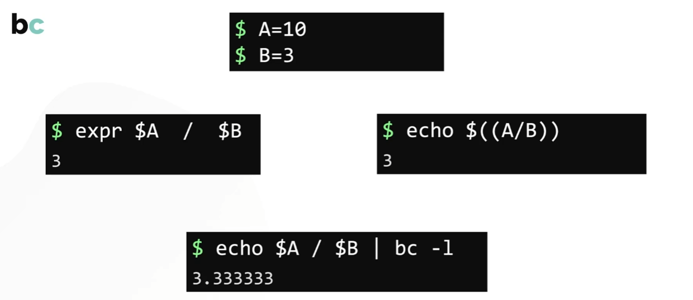

# Shell Scripts for Beginners

## Course Introduction

Shell Script를 이용한 자동화는 시간을 절약해주고 생산성을 향상시켜주기 때문에 시스템 관리자라면 반드시 알아야 하는 스킬이다. Shell Script를 이용하면 다음과 같은 업무에 도움이 될 수 있다.

- Automate Daily Backups
- Automate Installation and Patching of software on multiple servers
- Monitor system periodically
- Raise alarms and send notifications
- Troubleshooting and Audits
- Many More

이 강의에서는 Shell Script를 이용해서 우주로 로켓을 쏠 것이다(?). 로켓을 발사하는 과정은 다음과 같다.

1. Start Auxiliary Power
2. Switch to Internal Power
3. Auto Sequence Start
4. Main Engine Start
5. Lift Off

위 과정은 각각 command를 통해 이루어지기 때문에 각 프로세스에 해당하는 것들을 Shell Script로 만들어볼 예정이다.

## Shell Script Introduction

### Create your first shell script

로켓을 발사하기 위한 command를 하나씩 입력했던 것을 Shell Script로 작성하면 다음과 같다.

```bash
# create-and-launch-rocket.sh
mkdir lunar-mission

rocket-add lunar-mission

rocket-start-power lunar-mission
rocket-internal-power lunar-mission
rocket-start-sequence lunar-mission
rocket-start-engine lunar-mission
rocket-lift-off lunar-mission

rocket-status lunar-mission
```

위의 스크립트를 실행시키면 각 command가 한 줄씩 작동하게 된다.

생성한 sh파일을 실행시키기 위해 `create-and-launch-rocket` 을 command로 입력하면 command를 찾을 수 없다는 에러가 발생한다. command는 환경변수 `PATH` 의 경로에 있는 command만 인식할 수 있기 때문에 경로를 추가하거나 해당 폴더로 옮겨서 command를 실행할 수 있다.

command를 실행하기 위해서는 실행 권한을 가지고 있어야 한다. 따라서 실행 권한이 없을 경우에는 `chmod` 명령어로 실행 권한을 부여한다.

### Variables

- Shell Script에서 변수는 `$` 로 시작한다.

    ```bash
    # create-and-launch-rocket.sh
    mission_name=lunar-mission

    mkdir $mission_name

    rocket-add $mission_name

    rocket-start-power $mission_name
    rocket-internal-power $mission_name
    rocket-crew-ready $mission_name
    rocket-start-sequence $mission_name
    rocket-start-engine $mission_name
    rocket-lift-off $mission_name

    rocket_status=$(rocker-status $mission_name)
    echo "Status of launch: $rocket_status"
    ```

- 변수 이름은 항상 **Alphanumeric** 또는 **_** 로 이루어져야 하며, 대소문자를 구분한다. 대문자는 환경변수를 나타낸다.
- 명령어의 실행 결과는 `$(command)` 로 변수로 사용할 수 있다.
- 변수를 확실하게 나타내고자 할 때는 `${variable_name}` 를 사용한다.



### Command Line Arguments

하드코딩하여 Script를 실행할 때 마다 variable을 수정하는 것은 매우 비효율적인 일이다. 따라서 variable을 arugment로 사용할 수 있다.

- Augment는 0부터 시작한다. 0은 command이다.
- Shell Script에서는 `$` 뒤의 숫자를 붙이면 Argument로 인식한다.



- Argument를 Variable에 할당하지 않고 사용할 수도 있다. 그러나 이런 코드는 가독성을 떨어뜨리기 때문에 지양한다.



### Read Inputs

- `read` 명령어를 이용해서 stdin으로 받은 값을 Variable로 사용할 수 있다. `read` 명령어만 사용할 경우 입력 prompt만 보여지기 때문에 구체적으로 어떤 값에 대한 입력인지 알기 어렵기 때문에 `-p` 옵션을 이용하여 해당 Input에 대한 설명을 입력할 수 있다.
    - `read -p "Enter mission name:" mission_name`



### Arithmetic Operations

- `expr` : 사칙연산을 한다. 각 연산은 space로 구분되어야 한다.
    - `expr 6 + 3` → 9
    - `expr 6 - 3` → 3
    - `expr 6 / 3` → 2
    - `expr 6 \* 3` → 18 : 곱하기의 경우 `*`는 wildcard로 사용되기 때문에 escape 문자를 붙여서 사용한다.
- double parentheses : `(())`를 이용한 연산을 한다. `expr`과 달리 변수 앞에 `$`를 붙이거나 곱하기에 escape 문자를 사용하지 않아도 된다. 또한 증감연산자를 지원한다. return 값은 항상 정수이다.
    - `echo $(( A + B ))`
    - `echo $(( A-B ))`
    - `echo $(((A/B))`
    - `echo $(( A * B ))`
    - `echo $(( ++A ))`
    - `echo $(( --A ))`
    - `echo $(( A++ ))`
    - `echo $(( A-- ))`
- `bc` : basic calculator. 연산의 입력을 pipe로 받아야 한다.
    - `echo $A / $B | bc -l`
        - `-l` : floating point result

    
